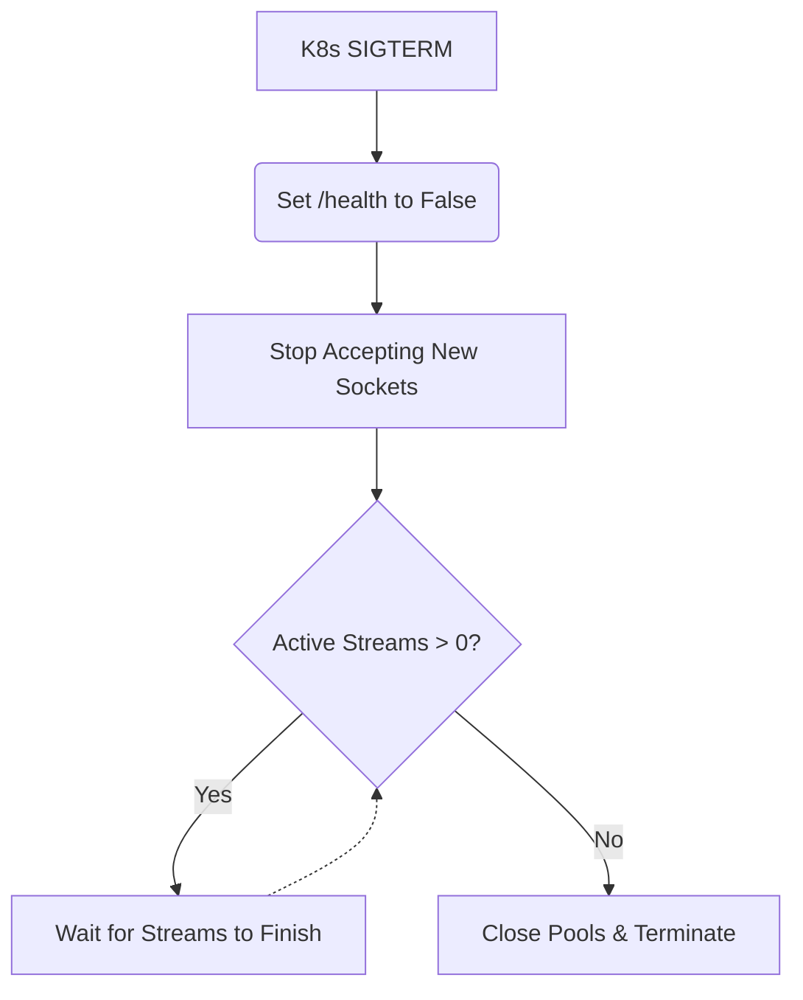

# Graceful Shutdown / Pod Drain

[⬅️ Back to Features Catalog](/docs/features-overview)

## What It Does
The **Graceful Shutdown** feature allows active Server-Sent Events (SSE) streams a configured window of time to finish during an orderly process termination (e.g., a Kubernetes scale-down or deployment rollout). 

## How It Works
When Kubernetes stops a pod, it sends a `SIGTERM` signal. The proxy intercepts this signal to facilitate a clean drain.

1. **Signal Interception:** The proxy catches the `SIGTERM` signal at the FastAPI lifecycle level.
2. **Readiness Toggle:** The application immediately marks its readiness probe as failed, instructing Kubernetes to stop routing new traffic to the pod.
3. **Drain Window:** The proxy waits until either the active-request count reaches zero, or the `DRAIN_TIMEOUT_SECONDS` limit expires. 
4. **Resource Closure:** Once the drain completes, the lifecycle teardown safely closes HTTP connection pools, Vault clients, and cryptographic resources.

## Performance Profile
- **Overhead:** Tracking active connections introduces minimal, environment-dependent overhead on the critical path.

## Configuration Flags

| Environment Variable | Description | Linked Guide |
| :--- | :--- | :--- |
| `DRAIN_TIMEOUT_SECONDS` | Maximum time to wait for active streams before forcing a shutdown (default 25s). | [View in deployment.md](/docs/deployment) |

## Implementation Details & Edge Cases
* **Kubernetes Orchestration:** You must configure the Kubernetes `terminationGracePeriodSeconds` to be *longer* than `DRAIN_TIMEOUT_SECONDS` (e.g., 30s grace period for a 25s drain timeout). Otherwise, Kubernetes will forcefully kill the pod with `SIGKILL` before the proxy can finish draining.
* **HTTP/2 Connection Pooling:** The shared `httpx.AsyncClient` pool is closed in its entirety after the drain wait expires. The proxy does not selectively close idle sockets upon receiving the signal.

## FAQ

**Q: Will users notice when a pod is draining?**
A: Existing streams are allowed to finish up to the `DRAIN_TIMEOUT_SECONDS` deadline. However, they can still be interrupted by upstream provider failures, client disconnects, or if the platform forcefully kills the pod.

**Q: Why does the proxy return a `429 Too Many Requests` when draining?**
A: While draining, any new requests that slip past the ingress controller before routing tables converge are immediately rejected with a `429`. This allows upstream gateways to safely retry the request against a healthy pod.

## Practical Effect
This feature prevents abrupt disconnection of active LLM streams during routine deployments and autoscaling events, provided the streams complete within the configured timeout window.

## Related Tests
Tests: [`tests/test_enterprise_resiliency.py`](https://github.com/ninadphalak/LLM-Shield-Proxy/blob/main/tests/test_enterprise_resiliency.py).
