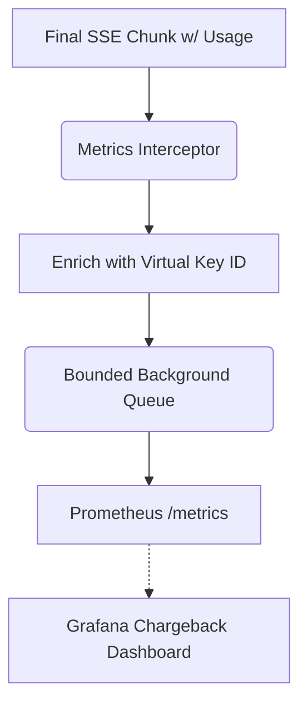

# LLM FinOps Chargeback Meter

[⬅️ Back to Features Catalog](/docs/features-overview)

## What It Does
The **LLM FinOps Chargeback Meter** provides enterprise-grade observability into AI consumption. It actively intercepts token usage statistics from upstream providers (like OpenAI and Anthropic) and streams them asynchronously as Prometheus metrics. This allows organizations to build strict, multi-tenant chargeback models, billing individual departments or users down to the exact fraction of a cent.

## How It Works
Without the proxy, an enterprise using a single corporate OpenAI key has no idea if the Marketing department is burning \`10,000 a month on GPT-4 while HR uses \`100.

1. **Usage Interception:** The proxy monitors the final chunk of Server-Sent Events (SSE) or the JSON root of non-streaming responses for the `usage` object (e.g., `prompt_tokens`, `completion_tokens`).
2. **Metadata Tagging:** It enriches this raw usage data with critical metadata: the `virtual_key_id`, the `applied_role_name`, the selected `model`, and the target `upstream_provider`.
3. **Asynchronous Emission:** Enriched metrics use a bounded background path to reduce request-path work. Queueing, serialization, synchronization, CPU use, and drops still require measurement.

View diagram on GitHub mobile 📱 -->

## Performance Profile
- **Performance:** Workload and environment dependent; measure this path under the published benchmark protocol.
- **Overhead:** Uses a bounded background queue to reduce request-path work. Queue operations and metric creation still consume resources, and pressure can cause metric drops.

## Configuration Flags

| Environment Variable | Description | Linked Deployment Guide |
| :--- | :--- | :--- |
| `ENABLE_FINOPS_METERING` | Enables supported token-usage extraction and metric recording. The FastAPI `/metrics` route remains part of the application and can be protected with `METRICS_BEARER_TOKEN`. | [View in deployment.md](/docs/deployment) |

## Critical Logic & Edge Cases
* **FinOps stream options:** On supported OpenAI-style requests, the proxy can request usage in the stream. Providers may omit or define usage differently; reconcile retries, cached/reasoning tokens, missing chunks, prices, and invoices before chargeback.
* **Anthropic Normalization:** Anthropic Claude uses different terminology (`input_tokens`, `output_tokens`) in its streaming events. The proxy automatically normalizes these into the standard `prompt_tokens` and `completion_tokens` metric labels.

## FAQ

**Q: Do I need a separate database to store these metrics?**
A: No. The proxy acts as a Prometheus exporter. You configure your existing Prometheus/Datadog agent to scrape the proxy's `/metrics` endpoint. The data is stored and queried inside your existing TSDB (Time Series Database).

**Q: Does this meter track the tokens saved by the PII redaction engine?**
A: Yes! The proxy exposes a specific metric `shield_proxy_tokens_saved_total` which calculates the delta between the length of the original bracketed structural tags and the length of the highly-optimized synthetic masked entities, allowing you to calculate the exact ROI (Return on Investment) of the proxy.

## Plainspeak
This feature is a highly detailed billing meter that helps companies figure out exactly which team is spending money on AI.

This feature associates observed provider usage events with configured tenant metadata. Use it for allocation estimates only after reconciling retries, cached or reasoning tokens, missing usage chunks, pricing changes, and the provider invoice.

## Related Tests
See the following test file for reference implementations and edge-case testing: [`tests/test_finops_meter.py`](https://github.com/ninadphalak/LLM-Shield-Proxy/blob/main/tests/test_finops_meter.py).
