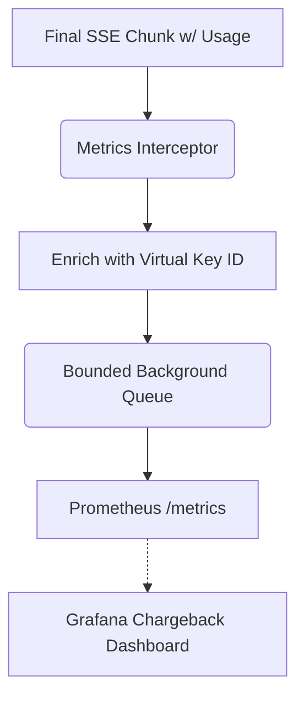

# Token Usage Cost Estimates

[⬅️ Back to Features Catalog](/docs/features-overview)

## What It Does
The meter reads supported provider usage fields and records Prometheus
metrics with configured tenant metadata. These metrics can support internal cost allocation. They
are not an invoice and do not calculate exact cost on their own.

## How It Works
When several teams share one provider account, provider totals may not show which internal team
made each request. The proxy adds configured identity and routing labels to the usage it observes.

1. **Usage extraction:** The proxy checks the final SSE event or non-streaming response for a
   supported `usage` object, such as `prompt_tokens` and `completion_tokens`.
2. **Metadata labels:** It records the usage with `virtual_key_id`, `applied_role_name`, `model`,
   and `upstream_provider` labels when available.
3. **Asynchronous Emission:** Enriched metrics use a bounded background path to reduce request-path work. Queueing, serialization, synchronization, CPU use, and drops still require measurement.

View diagram on GitHub mobile 📱 -->

## Performance Profile
- **Performance:** Workload and environment dependent; measure this path under the published benchmark protocol.
- **Overhead:** Uses a bounded background queue to reduce request-path work. Queue operations and metric creation still consume resources, and pressure can cause metric drops.

## Configuration Flags

| Environment Variable | Description | Linked Deployment Guide |
| :--- | :--- | :--- |
| `ENABLE_FINOPS_METERING` | Enables supported token-usage extraction and metric recording. The FastAPI `/metrics` route remains part of the application and can be protected with `METRICS_BEARER_TOKEN`. | [View in deployment.md](/docs/deployment) |

## Critical Logic & Edge Cases
* **FinOps stream options:** On supported OpenAI-style requests, the proxy can request usage in the stream. Providers may omit or define usage differently; reconcile retries, cached/reasoning tokens, missing chunks, prices, and invoices before chargeback.
* **Anthropic Normalization:** Anthropic Claude uses different terminology (`input_tokens`, `output_tokens`) in its streaming events. The proxy automatically normalizes these into the standard `prompt_tokens` and `completion_tokens` metric labels.

## FAQ

**Q: Do I need a separate database to store these metrics?**
A: No. The proxy acts as a Prometheus exporter. You configure your existing Prometheus/Datadog agent to scrape the proxy's `/metrics` endpoint. The data is stored and queried inside your existing TSDB (Time Series Database).

**Q: Does this meter track the tokens saved by the PII redaction engine?**
A: It exposes `shield_proxy_tokens_saved_total`, which records a difference between selected
replacement representations. This is not a provider token bill, cost saving, or ROI calculation.
Validate it against the tokenizer and pricing used by the selected provider before using it.

## Practical effect
This feature associates observed provider usage events with configured tenant metadata. Use it for allocation estimates only after reconciling retries, cached or reasoning tokens, missing usage chunks, pricing changes, and the provider invoice.

## Related Tests
Tests: [`tests/test_finops_meter.py`](https://github.com/ninadphalak/LLM-Shield-Proxy/blob/main/tests/test_finops_meter.py).
