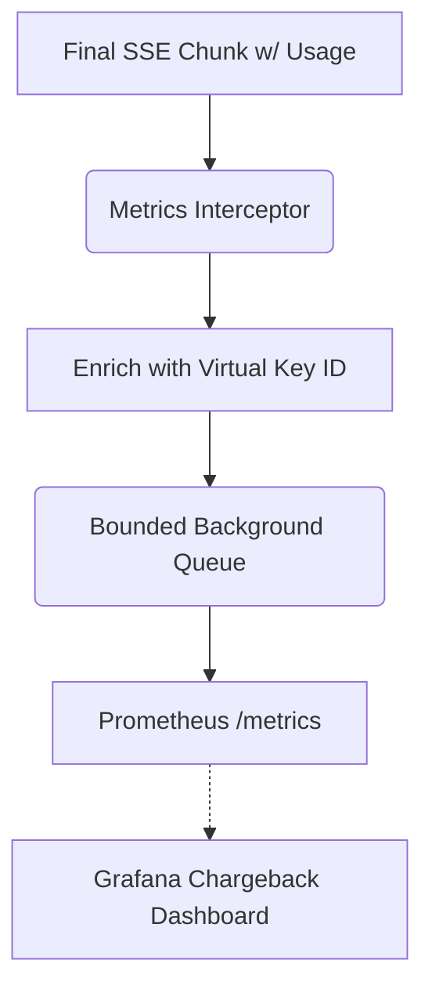

# Token Usage Cost Estimates

[⬅️ Back to Features Catalog](/docs/features-overview)

## What It Does
The **Chargeback Meter** extracts token usage data directly from supported provider responses and emits Prometheus metrics enriched with tenant metadata (e.g., the virtual key ID and role). These metrics assist with internal cost allocation (chargeback), though they do not calculate exact financial costs and are not a replacement for official provider invoices.

## How It Works
When multiple internal teams share a single corporate LLM provider account, the provider's billing dashboard cannot distinguish which internal team consumed the tokens. The proxy bridges this gap.

1. **Usage Extraction:** The proxy inspects the final SSE event or non-streaming response for the standard `usage` object (containing `prompt_tokens` and `completion_tokens`).
2. **Metadata Enrichment:** It attaches contextual labels to the usage metric, including `virtual_key_id`, `applied_role_name`, `model`, and `upstream_provider`.
3. **Asynchronous Emission:** The enriched metrics are placed in a bounded background queue to decouple metric generation from the latency-sensitive request path.

## Performance Profile
- **Overhead:** The background queue minimizes impact on request latency. However, extremely high concurrency can cause queue pressure, resulting in dropped metrics rather than slowed requests.

## Configuration Flags

| Environment Variable | Description | Linked Guide |
| :--- | :--- | :--- |
| `ENABLE_FINOPS_METERING` | Enables token-usage extraction and metric recording. | [View in deployment.md](/docs/deployment) |

*Note: The FastAPI `/metrics` route can be secured using the `METRICS_BEARER_TOKEN` environment variable.*

## Implementation Details & Edge Cases
* **FinOps Stream Options:** On supported OpenAI-style endpoints, the proxy automatically injects `stream_options: {"include_usage": true}` to ensure the provider includes the usage object in the final chunk.
* **Anthropic Normalization:** Anthropic Claude streams use different terminology (`input_tokens`, `output_tokens`). The proxy automatically normalizes these into the standard `prompt_tokens` and `completion_tokens` format for consistent querying.

## FAQ

**Q: Do I need a separate database to store these metrics?**
A: No. The proxy acts as a standard Prometheus exporter. You configure your existing observability agent (Prometheus, Datadog, etc.) to scrape the proxy's `/metrics` endpoint. 

**Q: Does this meter track the tokens saved by the PII redaction engine?**
A: The proxy exposes a `shield_proxy_tokens_saved_total` metric, which calculates the raw character difference between original PII and the injected synthetic substitutes. This is a rough estimation of payload size reduction, not an exact financial ROI calculation.

## Practical Effect
This feature associates raw provider token counts with specific internal identities, enabling organizations to build granular chargeback dashboards in Grafana. It provides an estimation for internal accounting, not a perfect financial audit trail.

## Related Tests
Tests: [`tests/test_finops_meter.py`](https://github.com/ninadphalak/LLM-Shield-Proxy/blob/main/tests/test_finops_meter.py).
