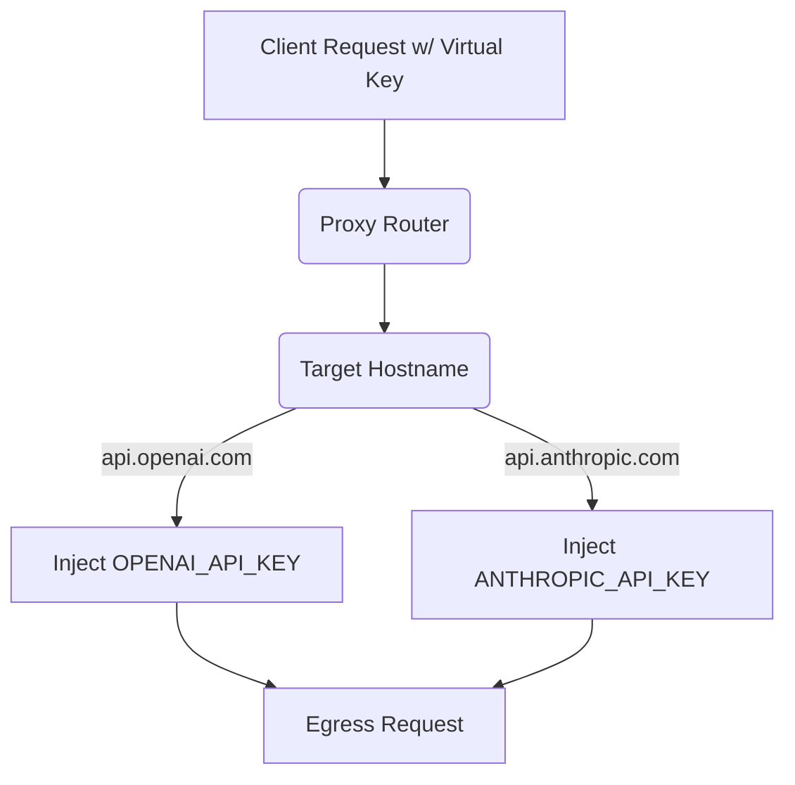

# Multi-Provider Upstream Key Registry

[⬅️ Back to Features Catalog](/docs/features-overview)

## What It Does
The **Multi-Provider Upstream Key Registry** centralizes and secures API key management for enterprises using multiple AI models. Instead of forcing client applications to juggle keys for OpenAI, Anthropic, Gemini, and DeepSeek, the proxy manages all upstream authentication securely behind the firewall, auto-resolving the correct key based on the target destination.

## How It Works
Distributing raw OpenAI or Anthropic API keys to hundreds of developers is a massive security risk. The proxy abstracts this entirely.

1. **Client Virtualization:** Developers authenticate to the proxy using a single, internally managed `virtual_key_id` (e.g., an internal Active Directory token or a proxy-generated UUID).
2. **Registry Mapping:** The proxy holds a secure, in-memory registry of real API keys mapped to specific provider hostnames.
3. **Dynamic Interception:** When a request is routed, the proxy intercepts the outbound connection, identifies the target hostname (e.g., `api.anthropic.com`), extracts the corresponding real API key from the registry, and injects it into the `Authorization` or `x-api-key` header just microseconds before egress.

View diagram on GitHub mobile 📱 -->

## Performance Profile
- **Performance:** Workload and environment dependent; measure this path under the published benchmark protocol.
- **Overhead:** Registry lookup is in-process for loaded keys. Authentication, copying, header construction, rotation, and any Vault refresh still have measurable cost.

## Configuration Flags

| Environment Variable | Description | Linked Deployment Guide |
| :--- | :--- | :--- |
| `OPENAI_API_KEY` | Key selected for the exact `api.openai.com` hostname. Azure endpoints currently fall back to `UPSTREAM_API_KEY`. | [View in deployment.md](/docs/deployment) |
| `ANTHROPIC_API_KEY` | Real key injected for Anthropic destinations. | [View in deployment.md](/docs/deployment) |
| `GEMINI_API_KEY` | Real key injected for Google Gemini destinations. | [View in deployment.md](/docs/deployment) |

## Critical Logic & Edge Cases
* **Key replacement:** On supported proxy paths, configured client credential headers are removed or replaced before the upstream request is built. Network bypass routes and unrecognized headers require separate controls and tests.
* **HashiCorp Vault Integration:** Keys can be loaded from Vault rather than a local `.env` or `ConfigMap`. Whether they appear in files, process memory, logs, snapshots, or deployment tooling depends on the complete secret-delivery path.

## FAQ

**Q: Can I use different OpenAI keys for different departments?**
A: Yes. While the global registry sets a baseline, you can define `upstream_api_key` overrides directly inside specific roles in `policies.yaml`. When the HR department authenticates, the proxy will resolve and inject the HR-specific OpenAI key instead of the global one.

**Q: How does this work with Azure OpenAI's authentication?**
A: The current hostname registry does not contain an Azure endpoint matcher or automatically select Azure's `api-key` header. Treat Azure as a documented integration gap: configure and verify the required upstream header outside this registry before relying on it.

## Plainspeak
Think of this as an exact-hostname key lookup for the providers listed in the implementation, with a configured `UPSTREAM_API_KEY` fallback. It is not a schema-aware credential broker.

The proxy can centralize provider credential selection so application developers do not embed each provider key. Operators still own key provisioning, access control, rotation, revocation, observability, and incident response.

## Related Tests
See the following test file for reference implementations and edge-case testing: [`tests/test_multi_tenant.py`](https://github.com/ninadphalak/LLM-Shield-Proxy/blob/main/tests/test_multi_tenant.py).
