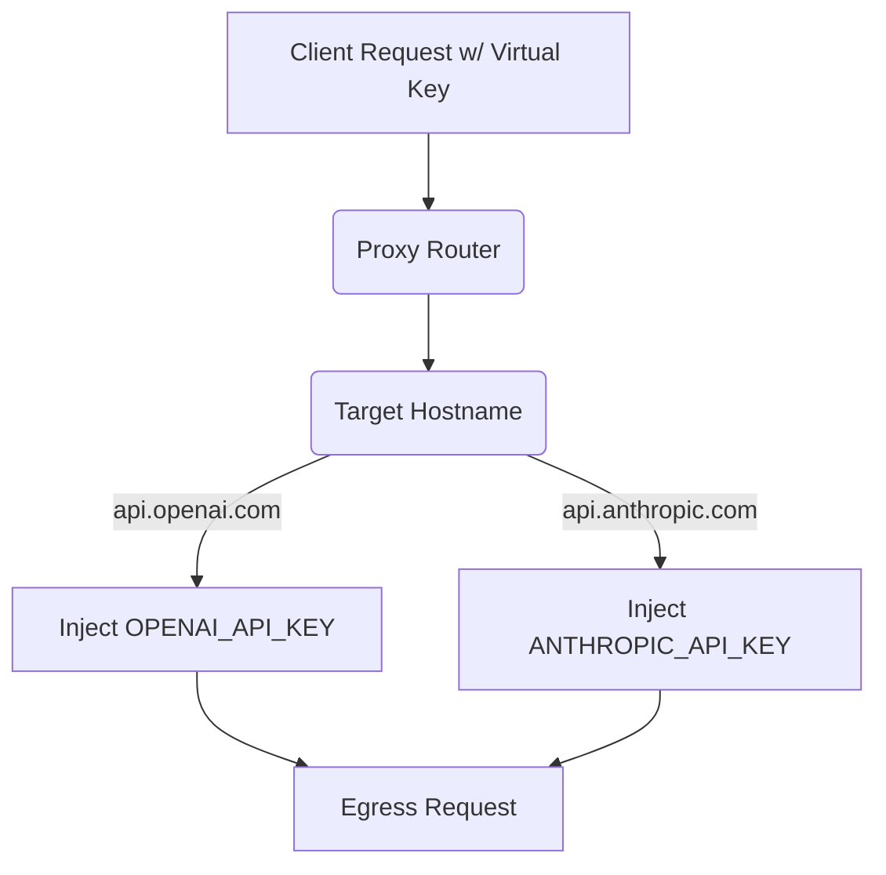

# Multi-Provider Upstream Key Registry

[⬅️ Back to Features Catalog](/docs/features-overview)

## What It Does
The **Multi-Provider Upstream Key Registry** manages provider API keys centrally within the proxy. Instead of distributing physical OpenAI or Anthropic API keys to developers, client applications authenticate to the proxy using a Virtual Key, and the proxy injects the correct provider key based on the target hostname.

## How It Works
Centralizing keys reduces the risk of key leakage in client code repositories, environments, and CI/CD pipelines.

1. **Client Virtualization:** Developers authenticate to the proxy using an internally managed `virtual_key_id` (e.g., an internal service token).
2. **Registry Mapping:** The proxy holds actual provider API keys in process memory, mapped to specific upstream hostnames.
3. **Header Injection:** Before sending the request upstream, the proxy strips any client-provided credential headers and injects the correct provider key for the destination hostname.

## Performance Profile
- **Overhead:** Key lookup occurs entirely in-process against loaded memory dictionaries, adding negligible latency to the request path.

## Configuration Flags

| Environment Variable | Description | Linked Guide |
| :--- | :--- | :--- |
| `OPENAI_API_KEY` | Key selected for the exact `api.openai.com` hostname. | [View in deployment.md](/docs/deployment) |
| `ANTHROPIC_API_KEY` | Key selected for Anthropic destinations. | [View in deployment.md](/docs/deployment) |
| `GEMINI_API_KEY` | Key selected for Google Gemini destinations. | [View in deployment.md](/docs/deployment) |

## Implementation Details & Edge Cases
* **Credential Stripping:** The proxy removes or overwrites existing authorization headers on supported paths to prevent developers from bypassing the registry or accidentally leaking keys.
* **HashiCorp Vault Integration:** Keys can be loaded from Vault directly into memory rather than via `.env` files, keeping physical keys entirely out of local disk storage.

## FAQ

**Q: Can I use different OpenAI keys for different departments?**
A: Yes. While the global environment variables set a baseline, you can define `upstream_api_key` overrides directly inside specific roles in `policies.yaml`. When a user authenticates, the proxy will resolve and inject the role-specific key instead of the global one.

**Q: How does this work with Azure OpenAI authentication?**
A: The proxy does not automatically select Azure's `api-key` header via this registry mechanism. You must configure and verify Azure-specific headers separately before relying on the proxy to forward traffic to Azure.

## Practical Effect
This feature eliminates the need for developers to manage external provider keys. The proxy acts as a secure credential broker, allowing operators to rotate, revoke, and manage keys centrally without requiring changes to downstream client applications.

## Related Tests
Tests: [`tests/test_multi_tenant.py`](https://github.com/ninadphalak/LLM-Shield-Proxy/blob/main/tests/test_multi_tenant.py).
