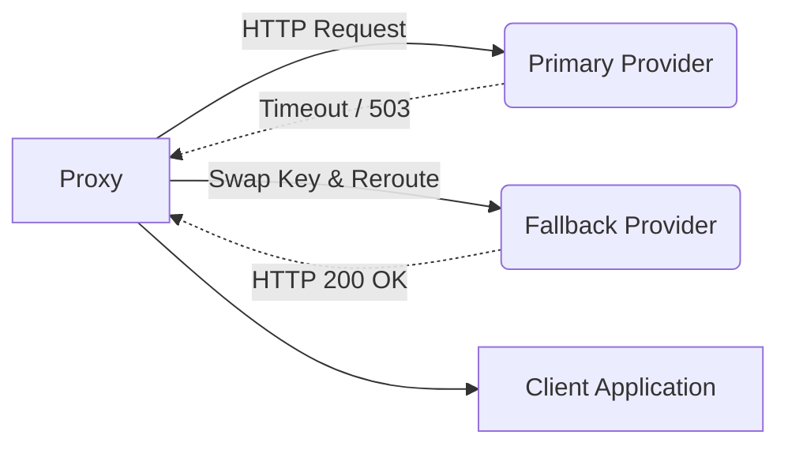

# Provider Failover Routing

[⬅️ Back to Features Catalog](../../../features-overview.md)

## What It Does
**Provider Failover Routing** ensures zero-downtime availability for critical AI pipelines. When the primary LLM provider (e.g., OpenAI) experiences an outage, network partition, or severe rate-limiting (HTTP 429), the proxy automatically and transparently re-routes the traffic to a pre-authorized secondary mirror (e.g., Azure OpenAI or Anthropic).

## How It Works
High Availability (HA) requires resilience against massive centralized outages.

1. **Error Interception:** The proxy's `httpx` client wraps outbound connections in an exception handler. If it detects a `502 Bad Gateway`, `503 Service Unavailable`, `504 Gateway Timeout`, or a severe `ConnectTimeout`, it intercepts the failure.
2. **Key-Swapping & Rerouting:** The proxy instantly swaps the primary `UPSTREAM_API_KEY` with the `FALLBACK_API_KEY`, updates the base URL, and re-issues the identical JSON payload to the fallback provider.
3. **Seamless Client UX:** The downstream client application receives the final successful stream without ever realizing the primary provider was offline.

View diagram on GitHub mobile 📱 -->

## Performance Profile
- **Execution Speed:** Rerouting logic takes `&lt;1ms`. The total latency delay perceived by the client is solely dependent on the `HTTP_TIMEOUT_SECONDS` configured for the primary attempt.
- **Overhead:** Retries utilize native `asyncio` to prevent thread blocking.

## Configuration Flags

| Environment Variable | Description | Linked Deployment Guide |
| :--- | :--- | :--- |
| `FALLBACK_BASE_URL` | The URL of the secondary provider. | [View in deployment.md](../../deployment.md) |
| `FALLBACK_API_KEY` | The API key for the secondary provider. | [View in deployment.md](../../deployment.md) |

## Critical Logic & Edge Cases
* **No Unapproved Model Downgrades:** The proxy will NEVER silently downgrade a model (e.g., from `gpt-4` to `gpt-3.5-turbo`) to achieve a successful response. It simply reroutes to the identical model name on the fallback URL. It is the operator's responsibility to ensure the fallback URL supports the requested model.
* **4xx Errors are Ignored:** The proxy only fails over on network timeouts and 50x server errors. If OpenAI returns a `400 Bad Request` (e.g., context window exceeded), the proxy passes the error directly to the client, as failing over would simply result in the exact same 400 error on the secondary provider.

## FAQ

**Q: Can I use this to failover between completely different providers, like OpenAI to Anthropic?**
A: Yes. Because the proxy integrates the [Multi-Provider Translators](./multi-provider-translators.md), if you configure an Anthropic fallback URL, the proxy will automatically translate the OpenAI schema into Claude's schema during the failover event.

**Q: How do I test that this works in production?**
A: You can force a failover by intentionally setting `UPSTREAM_BASE_URL` to a blackholed or invalid IP address (like `https://192.0.2.1`). The proxy will timeout on the primary and successfully route to the fallback.

## Plainspeak
This feature acts as an intelligent traffic cop for your AI requests.

When an AI provider like OpenAI goes down, normally your users just get an error screen. With this feature, the system instantly notices the outage and automatically detours the traffic to a working backup provider (like Anthropic) in the blink of an eye. The user never even notices there was a problem.

## Related Tests
See the following test file for reference implementations and edge-case testing: [`tests/test_enterprise_resiliency.py`](../../../tests/test_enterprise_resiliency.py).
