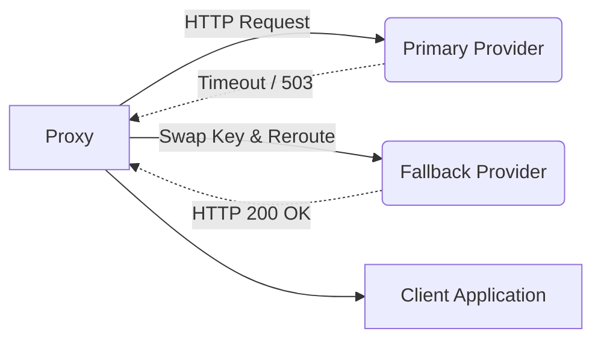

# Provider Failover Routing

[⬅️ Back to Features Catalog](/docs/features-overview)

## What It Does
**Provider Failover Routing** can attempt a pre-authorized secondary endpoint for selected primary-provider failures. It adds a recovery option but does not establish zero downtime, successful replay, or equivalent model behavior.

## How It Works
High Availability (HA) requires resilience against massive centralized outages.

1. **Error Interception:** The proxy's `httpx` client wraps outbound connections in an exception handler. If it detects a `502 Bad Gateway`, `503 Service Unavailable`, `504 Gateway Timeout`, or a severe `ConnectTimeout`, it intercepts the failure.
2. **Key-Swapping & Rerouting:** For an eligible failure, the proxy selects the configured fallback key and base URL and attempts the payload through the fallback path.
3. **Client-visible result:** A successful fallback can return through the same downstream API shape. It adds latency and may differ semantically; surface the failover in telemetry.

View diagram on GitHub mobile 📱 -->

## Performance Profile
- **Performance:** Workload and environment dependent; measure this path under the published benchmark protocol.
- **Overhead:** Retries utilize native `asyncio` to prevent thread blocking.

## Configuration Flags

| Environment Variable | Description | Linked Deployment Guide |
| :--- | :--- | :--- |
| `FALLBACK_BASE_URL` | The URL of the secondary provider. | [View in deployment.md](/docs/deployment) |
| `FALLBACK_API_KEY` | The API key for the secondary provider. | [View in deployment.md](/docs/deployment) |

## Critical Logic & Edge Cases
* **Model name preservation:** The routing path preserves the requested model name rather than intentionally substituting a lower-tier name. Operators must verify what that name resolves to at each provider and whether semantics match.
* **4xx Errors are Ignored:** The proxy only fails over on network timeouts and 50x server errors. If OpenAI returns a `400 Bad Request` (e.g., context window exceeded), the proxy passes the error directly to the client, as failing over would simply result in the exact same 400 error on the secondary provider.

## FAQ

**Q: Can I use this to failover between completely different providers, like OpenAI to Anthropic?**
A: The repository includes an Anthropic adapter for supported OpenAI-style fields. Validate the exact request features, tool schemas, error mapping, streaming events, and model-name resolution before using it as a cross-provider fallback.

**Q: How do I test that this works in production?**
A: In a non-production environment, direct the primary path to a controlled failing endpoint and verify whether the configured failure class triggers the fallback. Assert the audit signal, latency, response shape, and behavior when the fallback also fails.

## Plainspeak
This feature acts as an intelligent traffic cop for your AI requests.

For selected failure modes, the proxy can attempt a configured secondary endpoint. The retry adds latency and may still fail or produce different behavior; surface failover in telemetry and test it with production-shaped requests.

## Related Tests
See the following test file for reference implementations and edge-case testing: [`tests/test_enterprise_resiliency.py`](https://github.com/ninadphalak/LLM-Shield-Proxy/blob/main/tests/test_enterprise_resiliency.py).
