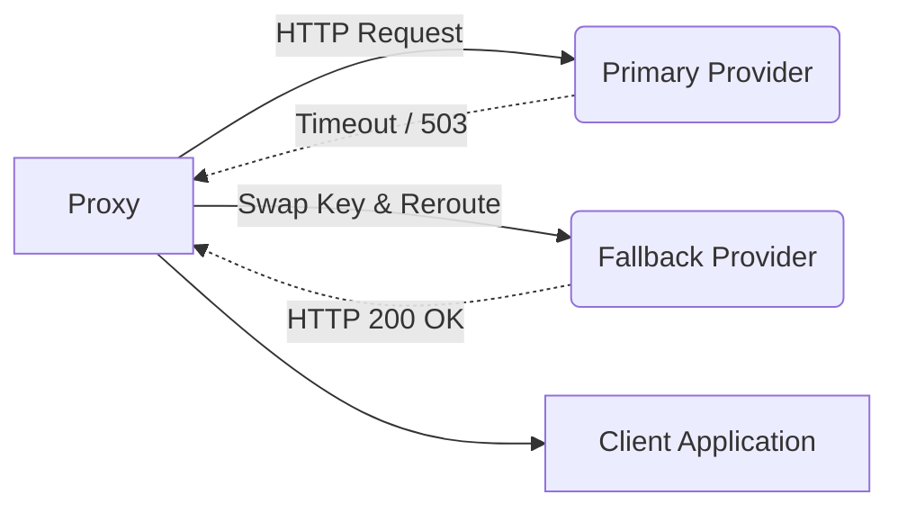

# Provider Failover Routing

[⬅️ Back to Features Catalog](/docs/features-overview)

## What It Does
**Provider Failover Routing** attempts to recover from primary provider outages by routing the request to a pre-authorized secondary endpoint. It provides a fallback path for specific transient or infrastructure errors but does not guarantee zero downtime or identical model behavior.

## How It Works
If a primary provider fails, the proxy intercepts specific error codes and retries the request against a configured secondary endpoint.

1. **Error Interception:** The proxy's `httpx` client monitors outbound connections. If it detects a `502 Bad Gateway`, `503 Service Unavailable`, `504 Gateway Timeout`, or a severe `ConnectTimeout`, it intercepts the failure.
2. **Key-Swapping & Rerouting:** For an eligible failure, the proxy selects the configured fallback API key and base URL, then attempts to send the payload to the fallback provider.
3. **Client-Visible Result:** If the fallback succeeds, the response is streamed back to the client as normal. The proxy surfaces the failover event in its telemetry.

## Performance Profile
- **Overhead:** A failover event intrinsically adds request latency, requires additional connection overhead, and consumes usage quota on the secondary provider.

## Configuration Flags

| Environment Variable | Description | Linked Guide |
| :--- | :--- | :--- |
| `FALLBACK_BASE_URL` | The URL of the secondary provider. | [View in deployment.md](/docs/deployment) |
| `FALLBACK_API_KEY` | The API key for the secondary provider. | [View in deployment.md](/docs/deployment) |

## Implementation Details & Edge Cases
* **Model Name Preservation:** The failover routing path sends the originally requested model name to the fallback provider. Operators must verify that the model name exists on the secondary provider and behaves as intended.
* **4xx Errors Excluded:** Client errors (e.g., `400 Bad Request`, `401 Unauthorized`) do not trigger a failover. Automatically replaying an invalid or unauthorized request could duplicate side effects or obscure the root cause.

## FAQ

**Q: Can I use this to failover between different providers, like OpenAI to Anthropic?**
A: The proxy includes an Anthropic adapter for supported OpenAI-style fields. However, you must carefully validate tool schemas, error mapping, and model-name resolution before relying on it as a cross-provider fallback.

**Q: How do I test that this works in production?**
A: In a non-production environment, route the primary path to a deliberately failing endpoint and verify that the configured failure class triggers the fallback.

## Practical Effect
For specific infrastructure failures, the proxy can seamlessly attempt a secondary endpoint. This adds resilience, but the retry adds latency and the fallback model may behave differently than the primary.

## Related Tests
Tests: [`tests/test_enterprise_resiliency.py`](https://github.com/ninadphalak/LLM-Shield-Proxy/blob/main/tests/test_enterprise_resiliency.py).
