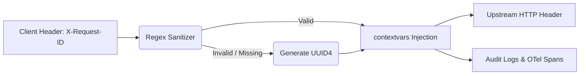

# Request-ID Correlation & Sanitization

[⬅️ Back to Features Catalog](/docs/features-overview)

## What It Does
**Request-ID Correlation & Sanitization** extracts, validates, or generates a unique correlation identifier for supported request and telemetry paths. This aids in end-to-end distributed tracing, provided downstream systems also log the identifier.

## How It Works
A consistent identifier simplifies multi-component debugging. The proxy normalizes this ID securely.

1. **Ingress Extraction:** When a request arrives, the proxy looks for the `X-Request-ID` or `X-Correlation-ID` HTTP headers.
2. **Regex Sanitization:** To prevent HTTP Header Injection attacks (CWE-113), the supplied ID is validated against a strict `^[a-zA-Z0-9-]{10,40}$` regular expression. Any ID containing invalid characters is discarded.
3. **UUID4 Generation:** If no valid header is found (or if it was discarded), the proxy automatically generates a cryptographically secure `UUID4`.
4. **Propagation:** The normalized ID is stored in `request.state`, returned to the client in the `X-Request-ID` response header, and attached to supported audit and error events.

## Performance Profile
- **Overhead:** Validating or generating a UUID introduces negligible overhead to the request path.

## Configuration Flags
The middleware enables this behavior automatically without a separate configuration flag.

## Implementation Details & Edge Cases
* **Response Echo:** The finalized `X-Request-ID` is echoed back in the proxy's response. However, upstream gateways or clients can strip or alter headers, so end-to-end verification is necessary.
* **Log-Injection Reduction:** Sanitizing control characters prevents basic log injection attacks. However, you must still apply defensive parsing when handling untrusted fields in downstream logging pipelines.

## FAQ

**Q: Can I use standard W3C `traceparent` headers instead?**
A: `X-Request-ID` is primarily for application-level correlation, while W3C `traceparent` is designed for distributed tracing systems. The proxy supports both; they have different propagation rules. See [Asynchronous OpenTelemetry Tracing](/docs/features/enterprise-auditing-compliance/zero-overhead-opentelemetry-otel-tracing).

**Q: Is the Request ID passed to OpenAI/Anthropic?**
A: Yes, the proxy forwards the request ID as a header to the upstream provider. Whether the provider preserves or exposes it in their logs depends entirely on the provider.

## Practical Effect
The proxy ensures every request has a safe, normalized tracking identifier that participating services can record. It acts as a correlation aid, though it does not guarantee proof of every hop if external systems drop the header.

## Related Tests
Tests: [`tests/test_security_hardening.py`](https://github.com/ninadphalak/LLM-Shield-Proxy/blob/main/tests/test_security_hardening.py).
