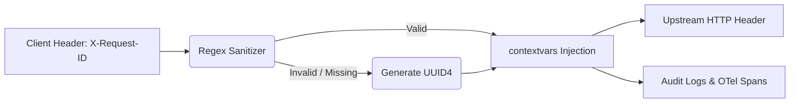

# Request-ID Correlation & Sanitization

[⬅️ Back to Features Catalog](/docs/features-overview)

## What It Does
**Request-ID Correlation & Sanitization** normalizes a correlation identifier for supported request, response, and telemetry paths. End-to-end traceability depends on every participating component preserving and indexing the identifier.

## How It Works
A consistent identifier can make multi-component debugging substantially easier when each component records it.

1. **Ingress Extraction:** When a request arrives, the proxy looks for the `X-Request-ID` or `X-Correlation-ID` HTTP headers.
2. **Regex Sanitization:** To prevent HTTP Header Injection attacks (CWE-113), the supplied ID is validated against a strict `^[a-zA-Z0-9-]{10,40}$` regex. If it contains invalid characters (like newlines or scripts), it is discarded.
3. **UUID4 Generation:** If no valid header is found, the proxy automatically generates a cryptographically secure `UUID4`.
4. **Supported propagation:** The normalized ID is stored on `request.state`, returned in the `X-Request-ID` response header, and passed explicitly into supported audit/error events. The current catch-all path does not promise automatic propagation to every log line, trace span, or upstream request.

View diagram on GitHub mobile 📱 -->

## Performance Profile
- **Performance:** Workload and environment dependent; measure this path under the published benchmark protocol.
- **Overhead:** The middleware validates or generates an ID and stores it in request context.
  Measure its cost as part of the complete request path.

## Configuration Flags
The middleware enables this behavior without a separate configuration flag.

## Critical Logic & Edge Cases
* **Response echo:** The supported proxy response path adds the finalized `X-Request-ID`. Gateways and clients can remove or replace headers, so verify the complete path.
* **Log-injection reduction:** Sanitizing control characters reduces request-ID log injection. Logging format, downstream parsing, and every other untrusted field still require defensive handling.

## FAQ

**Q: Can I use standard W3C `traceparent` headers instead?**
A: `X-Request-ID` supports application correlation, while W3C `traceparent` supports distributed tracing. They have different trust and propagation rules; test both across the selected gateways and collectors. See [Asynchronous OpenTelemetry Tracing](/docs/features/enterprise-auditing-compliance/zero-overhead-opentelemetry-otel-tracing).

**Q: Is the Request ID passed to OpenAI/Anthropic?**
A: The supported upstream path adds the request ID as a header. Whether a provider preserves,
records, or exposes it depends on that provider. Treat it as a correlation hint, not proof.

## Practical effect
The proxy assigns or normalizes a tracking identifier that participating services can record. It is a correlation aid, not proof of every hop or event.

## Related Tests
Tests: [`tests/test_security_hardening.py`](https://github.com/ninadphalak/LLM-Shield-Proxy/blob/main/tests/test_security_hardening.py).
