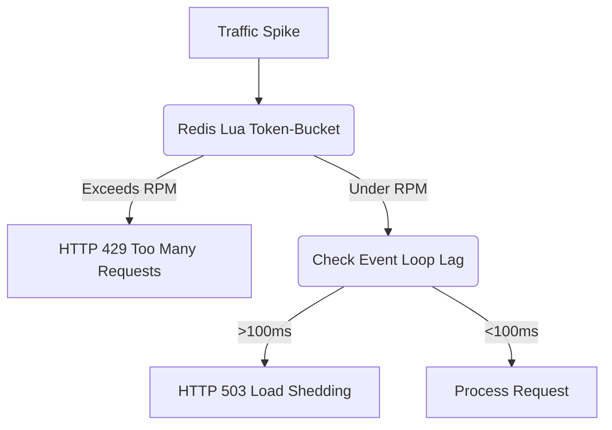

# Traffic Controls and Resilience

[⬅️ Back to Features Catalog](/docs/features-overview)

## What It Does
This feature combines token-bucket rate limits, event-loop lag detection, and timeout disciplines to manage system load and mitigate overload conditions. It aims to protect the proxy from traffic spikes, though it does not guarantee universal availability.

## How It Works
The proxy uses asynchronous Python capabilities and Redis Lua scripts to throttle or reject requests during overload scenarios.

1. **Token-Bucket Rate Limiting:** The proxy executes an atomic Lua script (`evalsha`) on the Redis cluster for incoming requests. It enforces a Requests Per Minute (RPM) limit based on the client's Virtual Key.
2. **Concurrency Shedding:** The proxy measures event-loop lag. If the lag exceeds a configured threshold, it can shed load by rejecting new requests with an `HTTP 503 Service Unavailable`.
3. **Timeout Disciplines:** The shared HTTP client enforces connect, read, write, and pool timeouts to prevent hung sockets from exhausting connection pools.

## Performance Profile
- **Overhead:** Rejected requests bypass the JSON lexer and PII redaction cascade entirely. However, the rate-limit checks (Redis network calls) and middleware execution still consume minor resources before rejection.

## Configuration Flags

| Environment Variable | Description | Linked Guide |
| :--- | :--- | :--- |
| `RATE_LIMIT_RPM` | Requests per minute per virtual key (default 6000 when enabled). | [View in deployment.md](/docs/deployment) |
| `RATE_LIMIT_BURST` | Token-bucket burst capacity (default 200 when enabled). | [View in deployment.md](/docs/deployment) |

## Implementation Details & Edge Cases
* **Burst Allowances:** The token-bucket allows for short bursts up to the configured capacity. Actual admission behavior depends on refill rates and Redis availability.
* **Upstream Timeout Segregation:** Connect and read timeouts are tuned independently. TCP/TLS handshakes are not instantaneous, so select timeout values based on measured network behavior.

## FAQ

**Q: Can I set different rate limits for different departments?**
A: Yes. Using `policies.yaml`, you can assign specific limits to specific roles (e.g., `rate_limit_rpm: 10000` for `role_data_science`, and `rate_limit_rpm: 100` for `role_interns`).

**Q: What happens if Redis goes down? Do all requests get rate-limited?**
A: By default, the rate limiter fails open. If Redis is unavailable, the proxy logs a warning and allows the request through. If you require strict enforcement during outages, you must configure a fail-closed policy.

## Practical Effect
The proxy uses a token bucket to throttle excessive requests per virtual key, returning an HTTP 429. Under severe load, event-loop lag detection will reject new requests with an HTTP 503. Together, these controls reduce the risk of catastrophic overload, though they cannot guarantee perfect availability.

## Related Tests
Tests: [`tests/test_enterprise_resiliency.py`](https://github.com/ninadphalak/LLM-Shield-Proxy/blob/main/tests/test_enterprise_resiliency.py).
