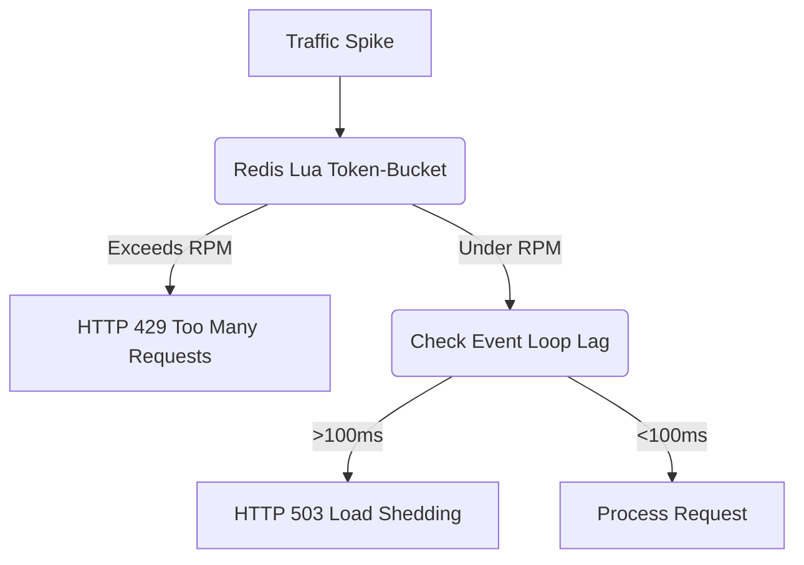

# Traffic Controls and Resilience

[⬅️ Back to Features Catalog](/docs/features-overview)

## What It Does
These controls combine rate limits, timeouts, retries, and shutdown behavior for selected overload
and dependency failures. The project does not publish a universal availability SLO; capacity and
availability must be measured for the deployed topology.

## How It Works
The proxy uses `asyncio` and Redis Lua scripts to apply rate limits and reject some new requests
when the service is overloaded.

1. **Token-Bucket Rate Limiting:** The proxy executes a Lua script (`evalsha`) on the Redis cluster for every incoming request. It enforces a strict RPM (Requests Per Minute) limit mapped to the client's Virtual Key.
2. **Concurrency shedding:** When the measured event-loop lag crosses the configured threshold, supported new-request paths can return `503`. Detection and routing are not instantaneous and do not guarantee active-stream health.
3. **Timeout disciplines:** The shared HTTP client applies configured connect, read, write, and pool timeouts. Total wall-clock duration can also include retries, queueing, DNS, streaming, and application work.

View diagram on GitHub mobile 📱 -->

## Performance Profile
- **Performance:** Workload and environment dependent; measure this path under the published benchmark protocol.
- **Overhead:** Rejected requests skip the JSON lexer and PII cascade, but rate-limit checks,
  Redis calls, middleware, and response handling still use resources.

## Configuration Flags

| Environment Variable | Description | Linked Deployment Guide |
| :--- | :--- | :--- |
| `RATE_LIMIT_RPM` | Requests per minute per virtual key (default 6000 when enabled). | [View in deployment.md](/docs/deployment) |
| `RATE_LIMIT_BURST` | Token-bucket burst capacity (default 200 when enabled). | [View in deployment.md](/docs/deployment) |

## Critical Logic & Edge Cases
* **Burst allowances:** Token-bucket configuration can permit bursts up to its capacity. Exact admission behavior depends on refill rate, clock, Redis availability, concurrency, and tenant-key construction.
* **Upstream timeout segregation:** Connect and read timeouts can be tuned independently. Choose values from measured network and provider behavior; TCP/TLS handshakes are not instantaneous.

## FAQ

**Q: Can I set different rate limits for different departments?**
A: Yes! Using `policies.yaml`, you can assign `rate_limit_rpm: 10000` to a `role_data_science`, while limiting `role_interns` to `100`.

**Q: What happens if Redis goes down? Do all requests get rate-limited?**
A: The rate limiter fails open by default. If Redis is unavailable, the proxy logs a warning and
allows the request. Configure and test a fail-closed policy if rate enforcement must continue
during a Redis outage.

## Practical effect
The proxy uses a token bucket to limit requests per virtual key. Requests over the configured
limit receive HTTP 429. The event-loop lag check can reject some new requests with HTTP 503.
These controls reduce overload risk but do not guarantee availability.

## Related Tests
Tests: [`tests/test_enterprise_resiliency.py`](https://github.com/ninadphalak/LLM-Shield-Proxy/blob/main/tests/test_enterprise_resiliency.py).
