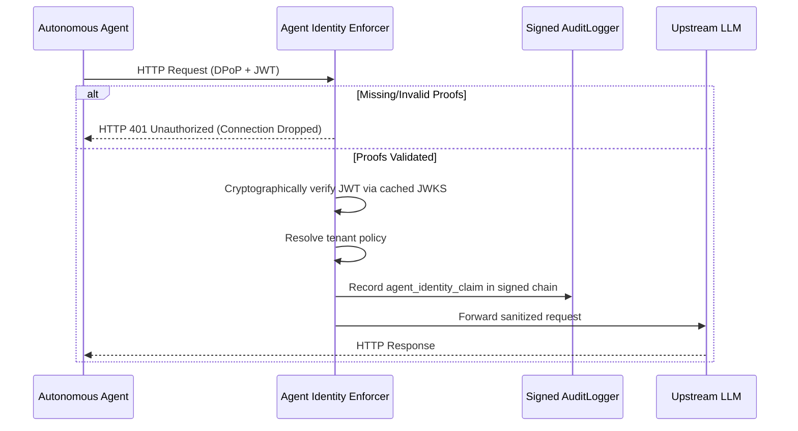

# Agent Identity Enforcer

The Agent Identity Enforcer validates configured workload-identity and proof-of-possession inputs before supported agent operations. Its assurance depends on issuer trust, key custody, audience and claim validation, replay storage, clock handling, and deployment configuration.

## Architectural Overview

By default, LLM-Shield-Proxy authenticates clients with virtual API keys. When enabled, the
Agent Identity Enforcer also requires a signed workload JWT and a Demonstrating Proof-of-Possession
(DPoP) proof for supported agent operations.

This middleware validates proofs using cached JSON Web Key Sets (JWKS), enforces per-tenant policies, and records validated identity metadata in a signed sequential SHA-256 audit chain.

### Request Flow Diagram



## Configuration

To globally configure the Enforcer, set the environment variable to one of the following 3 states:
```env
AGENT_IDENTITY_ENFORCER="off"
```
* `"off"`: The identity-enforcement middleware does not require these proofs (default); other authentication layers may still apply.
* `"lenient"`: Verifies the base JWT/Identity and signature, but skips the strict DPoP URI (htu) and Method (htm) validations.
* `"strict"`: Validates the configured JWT and DPoP checks, including `cnf.jkt`, method, URI, freshness, and replay state. It protects that authentication path only; issuer/audience policy, key discovery, cache behavior, proxies, and authorization remain separate boundaries.

For per-tenant enforcement, configure your `policies.yaml`:
```yaml
virtual_keys:
  vk_tenant_alpha: "strict_agent_role"

roles:
  strict_agent_role:
    agent_identity_enforcer: "strict"
```

## DPoP Replay Protection (RFC 9449 §11.1)

Signature and freshness checks alone don't stop an eavesdropper from capturing a valid
`(Workload JWT, DPoP proof)` pair off the wire and replaying it verbatim for the rest of
the proof's freshness window -- the proof is still cryptographically valid, so signature
verification wouldn't catch it. The Enforcer closes that gap with a server-side replay
cache:

* Every DPoP proof must carry a `jti` claim. A proof with no `jti` is rejected outright,
  because the verifier cannot check that proof for reuse.
* On each request, the proxy computes `f"{jkt}:{jti}"` (the JWK thumbprint bound to the
  proof, plus its unique ID) and checks it against an in-memory `TTLCache` (300s TTL,
  matching the proof's own maximum freshness window). A cache hit means this exact proof
  was already consumed -- the request is dropped with `HTTP 401 "DPoP proof replayed"`,
  even though the JWT, DPoP signature, `htm`/`htu` binding, and `cnf.jkt` thumbprint all
  check out.
* The check runs *after* signature and freshness validation but *before* the `cnf.jkt`
  binding check, so an unauthenticated caller can't cheaply flood the replay cache with
  garbage `jti` values before the proof has been verified at all.
* This is enforced regardless of `"lenient"` vs `"strict"` mode -- replay protection isn't
  part of the `htm`/`htu` tier that lenient mode relaxes.

Replay protection is per process. A proof can be replayed against another replica during the
TTL window because the cache is not shared through Redis. Use a single replica or sticky routing
if that limitation is acceptable. Multi-replica deployments that require cross-pod replay
detection need a shared store, such as Redis `SETNX` with the same 300-second TTL.

## In plain English

Shared API keys identify a tenant, not an individual agent process. The optional identity enforcer
requires each supported operation to carry a signed workload identity and a proof bound to the
request. The proxy validates both, applies policy, and records the decision metadata for later
review.

This improves attribution within the configured trust model. It does not prove who controlled the
agent, protect a stolen signing key, or replace authorization policy.
