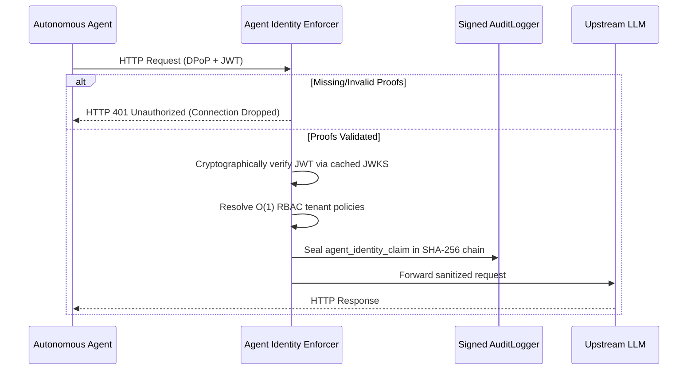

# Agent Identity Enforcer

The Agent Identity Enforcer is an edge-level zero-trust middleware for LLM-Shield-Proxy. It guarantees mathematically proven machine-to-machine identities for autonomous agent workflows by acting as a strict, cryptographic ingress barrier.

## Architectural Overview

By default, LLM-Shield-Proxy trusts upstream clients based on virtual API keys. The Agent Identity Enforcer upgrades this to a cryptographic zero-trust model where every tool-call intent is validated against a signed Workload Identity (JWT) and a Demonstrating Proof-of-Possession (DPoP) proof.

This middleware validates proofs using cached JSON Web Key Sets (JWKS), enforces per-tenant policies, and records validated identity metadata in a signed sequential SHA-256 audit chain.

### Request Flow Diagram



## Configuration

To globally configure the Enforcer, set the environment variable to one of the following 3 states:
```env
AGENT_IDENTITY_ENFORCER="off"
```
* `"off"`: Identity verification is bypassed completely (Default).
* `"lenient"`: Verifies the base JWT/Identity and signature, but skips the strict DPoP URI (htu) and Method (htm) validations.
* `"strict"`: Fully secures the proxy by strictly validating the JWT, binding the DPoP key to the `cnf.jkt` claim, and enforcing HTTP Method and URI matches. **Note:** Keeping this in strict mode will immediately drop (HTTP 401) any malformed or non-compliant agent requests.

For per-tenant enforcement, configure your `policies.yaml`:
```yaml
virtual_keys:
  vk_tenant_alpha: "strict_agent_role"

roles:
  strict_agent_role:
    agent_identity_enforcer: "strict"
```

## DPoP Replay Protection (RFC 9449 §11.1)

Signature and freshness checks alone don't stop an eavesdropper from capturing a valid
`(Workload JWT, DPoP proof)` pair off the wire and replaying it verbatim for the rest of
the proof's freshness window -- the proof is still cryptographically valid, so signature
verification wouldn't catch it. The Enforcer closes that gap with a server-side replay
cache:

* Every DPoP proof must carry a `jti` claim. A proof with no `jti` is rejected outright,
  since it can never be checked for reuse.
* On each request, the proxy computes `f"{jkt}:{jti}"` (the JWK thumbprint bound to the
  proof, plus its unique ID) and checks it against an in-memory `TTLCache` (300s TTL,
  matching the proof's own maximum freshness window). A cache hit means this exact proof
  was already consumed -- the request is dropped with `HTTP 401 "DPoP proof replayed"`,
  even though the JWT, DPoP signature, `htm`/`htu` binding, and `cnf.jkt` thumbprint all
  check out.
* The check runs *after* signature and freshness validation but *before* the `cnf.jkt`
  binding check, so an unauthenticated caller can't cheaply flood the replay cache with
  garbage `jti` values before the proof has been verified at all.
* This is enforced regardless of `"lenient"` vs `"strict"` mode -- replay protection isn't
  part of the `htm`/`htu` tier that lenient mode relaxes.

Replay protection is per-process (the cache isn't currently shared across replicas via
Redis), so a proof reused against a *different* pod within the TTL window would not be
caught today. Treat this the same as any other per-process cache in the proxy (e.g. the
in-memory rate limiter fallback): sufficient for single-replica or sticky-routing
deployments, and a natural extension point (a Redis-backed `SETNX` with the same 300s TTL)
for multi-replica fleets that need cross-pod replay detection.

## Plainspeak

Imagine a company with 50 different AI agents performing automated tasks like reading emails or querying databases.

**The Problem:** Normally, when an agent requests an action (like "delete database row"), it uses a generic, shared API password. If an agent goes rogue, the security team knows a password was used, but they cannot prove exactly *which* agent used it or verify that it had the authority to act at that exact second.

**The Solution:** Before an agent can execute a tool, it presents a signed DPoP/workload token instead of relying only on a shared password. The proxy validates the proof against policy and records identity metadata, time, and decision in its tamper-evident audit chain for later verification.

It is the difference between a building having a single front-door key that everyone shares, versus requiring every individual to scan a biometric badge every single time they open a door.
