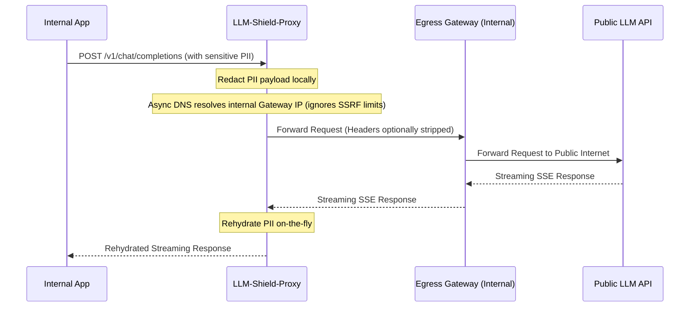

# Air-Gapped Egress Gateway Mode

LLM-Shield-Proxy provides an **Air-Gapped Egress Gateway Mode** for environments with strict Zero-Internet corporate subnet architectures. When operating in high-security, highly-regulated enclaves, servers are often denied direct access to the public internet to prevent data exfiltration.

In this mode, LLM-Shield-Proxy never connects directly to public LLM APIs (like OpenAI, Anthropic). Instead, all upstream traffic is securely routed through an internal, trusted egress proxy (e.g., Envoy, Squid, LiteLLM) configured on the private network.

## Inner Workings & Topology

The topology in Air-Gapped Mode ensures that the proxy is completely isolated from the internet:

## Configuration Flags

The behavior is controlled by several key flags (see [Deployment Configuration](/docs/deployment) for a full reference):

- `AIR_GAPPED_MODE` (bool): Master toggle to enable strict Zero-Internet routing.
- `EGRESS_GATEWAY_URL` (string): The internal proxy URL. Required if `AIR_GAPPED_MODE` is `true`. (e.g., `http://egress-proxy.internal:8080`).
- `FORWARD_CLIENT_AUTH` (bool): Defaults to `false`. If disabled, `authorization` and `x-api-key` headers are completely stripped before leaving the LLM-Shield.

## Critical Logic & Conditional Behaviors

### 1. SSRF Protection Bypass for Internal Gateways
Normally, the LLM-Shield Proxy strictly blocks requests targeting internal or private RFC 1918 IP addresses to prevent Server-Side Request Forgery (SSRF). However, when `AIR_GAPPED_MODE` is active, the `EGRESS_GATEWAY_URL` is parsed by a dedicated, non-blocking async DNS resolver (`_resolve_internal_hostname`) that explicitly *allows* private IPs. The resolved internal IP is substituted into the connection URL so the socket connects to that pinned address rather than re-resolving the hostname at connect time (closing the DNS-rebinding TOCTOU window between the check and the actual connection).

Pinning the socket to a resolved IP would normally break TLS: `httpx`/`httpcore` validate the server certificate against whatever hostname is in the connection URL, and a real certificate almost never carries a bare IP in its SAN. To avoid that, the proxy separately carries the original `EGRESS_GATEWAY_URL` hostname through as an `extensions={"sni_hostname": ...}` override on the outbound `httpx` request -- so the socket connects to the pinned IP, but TLS SNI negotiation and certificate hostname verification happen against the real gateway hostname. The `Host` HTTP header is set the same way, independently of the SNI override.

### 2. Authorization Header Stripping
For internal mTLS deployments, you might configure your egress gateway to inject the public API keys, effectively treating LLM-Shield as an untrusted internal node that does not have access to the actual LLM API keys.
By setting `FORWARD_CLIENT_AUTH=False`, LLM-Shield guarantees that no client-provided `Authorization`, `x-api-key`, `x-goog-api-key`, or `api-key` headers are leaked to the egress gateway.

### 3. Transparent Streaming
Because LLM-Shield manipulates the upstream route via `httpx.AsyncClient`, the core streaming engine remains agnostic to the gateway hop. Standard SSE processing, including the sliding-window de-redaction buffer, functions identically to a direct internet connection.

## Targeted FAQ

**Q: Does Air-Gapped Mode support multiple LLM providers?**
Yes. LLM-Shield routes all upstream paths directly to the `EGRESS_GATEWAY_URL` while preserving the exact pathing (e.g., `/v1/chat/completions`). It is the responsibility of the Egress Gateway to correctly route to the appropriate public LLM.

**Q: Do I need to supply an `UPSTREAM_API_KEY` to LLM-Shield in Air-Gapped Mode?**
No, if `FORWARD_CLIENT_AUTH` is disabled and the egress gateway handles the authentication, LLM-Shield does not need to possess the upstream API keys.

**Q: Can I use this with TLS termination?**
Yes. You can configure `EGRESS_GATEWAY_URL` with `https://` and supply the `SSL_CA_BUNDLE_PATH` so LLM-Shield can verify the egress gateway's internal certificates. Certificate hostname verification is checked against the gateway's real hostname (via the SNI pinning described above), not the resolved IP -- so a normal, domain-issued internal certificate works as expected even though the socket itself connects to the pinned IP.

## Related Tests
See the following test file for reference implementations and edge-case testing: [`tests/test_air_gapped_egress.py`](https://github.com/YOUR_ORG/LLM-Shield-Proxy/blob/main/tests/test_air_gapped_egress.py).
