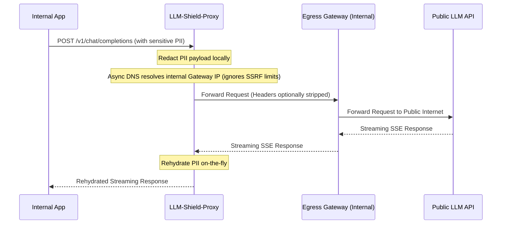

# Internal Egress Gateway Mode

This mode sends supported upstream requests to a configured internal egress gateway instead of
directly to a public provider.

In this mode, the supported upstream path targets the configured internal egress gateway rather than a public provider URL. Enforce and verify the boundary with network policy, DNS, firewall telemetry, and tests for telemetry, updates, model downloads, and error paths.

## Inner Workings & Topology

The intended topology isolates the proxy from direct internet routes; deployment controls should enforce and test that property:

## Configuration Flags

The behavior is controlled by several key flags (see [Deployment Configuration](/docs/deployment) for a full reference):

- `AIR_GAPPED_MODE` (bool): Master toggle to enable strict Zero-Internet routing.
- `EGRESS_GATEWAY_URL` (string): The internal proxy URL. Required if `AIR_GAPPED_MODE` is `true`. (e.g., `http://egress-proxy.internal:8080`).
- `FORWARD_CLIENT_AUTH` (bool): Defaults to `false`. On supported forwarding paths, configured client-auth headers are removed before the gateway request is built.

## Critical Logic & Conditional Behaviors

### 1. Private addresses are allowed for the configured gateway

The normal SSRF check blocks private addresses. With `AIR_GAPPED_MODE` enabled, the dedicated
resolver allows private addresses for `EGRESS_GATEWAY_URL`. It resolves the hostname once and
connects to that IP, which prevents a second DNS lookup from changing the destination before the
connection.

Connecting by resolved IP can fail hostname verification when the certificate contains the DNS name rather than that IP. The proxy separately carries the original `EGRESS_GATEWAY_URL` hostname as an `extensions={"sni_hostname": ...}` override, so the socket uses the validated IP while TLS verifies the configured hostname. The `Host` header is set separately. Exercise this behavior through the selected `httpx`/`httpcore` versions and gateway certificate chain.

### 2. Authorization Header Stripping
For internal mTLS deployments, you might configure your egress gateway to inject the public API keys, effectively treating LLM-Shield as an untrusted internal node that does not have access to the actual LLM API keys.
With `FORWARD_CLIENT_AUTH=False`, the supported forwarding path removes the listed client-provided credential headers. Test aliases, mixed case, duplicate headers, adapters, and alternate routes in the selected deployment.

### 3. Streaming behavior

The proxy still processes SSE through its normal streaming and rehydration path. The extra gateway
hop can add latency and introduces another failure point.

## Targeted FAQ

**Q: Does Air-Gapped Mode support multiple LLM providers?**
The proxy preserves supported request paths, such as `/v1/chat/completions`, when it sends them to
`EGRESS_GATEWAY_URL`. The egress gateway should select the public provider.

**Q: Do I need to supply an `UPSTREAM_API_KEY` to LLM-Shield in Air-Gapped Mode?**
No, if `FORWARD_CLIENT_AUTH` is disabled and the egress gateway handles the authentication, LLM-Shield does not need to possess the upstream API keys.

**Q: Can I use this with TLS termination?**
Set `EGRESS_GATEWAY_URL` to an `https://` URL and configure `SSL_CA_BUNDLE_PATH` for the internal
certificate authority. The connection uses the resolved IP, but certificate verification uses the
configured gateway hostname through SNI. Test this with the exact HTTP client version and
certificate chain used in production.

## Related Tests
Tests: [`tests/test_air_gapped_egress.py`](https://github.com/ninadphalak/LLM-Shield-Proxy/blob/main/tests/test_air_gapped_egress.py).
