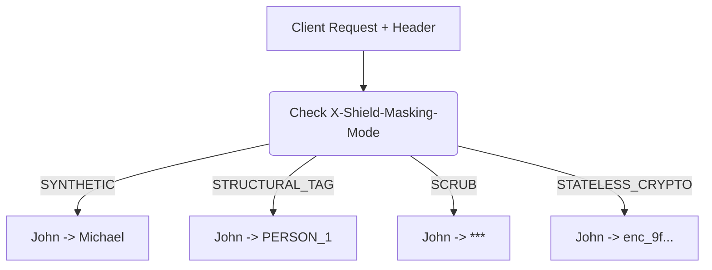

# 4-Mode Per-Request Masking Pipeline

[⬅️ Back to Features Catalog](/docs/features-overview)

## What It Does
The **4-Mode Per-Request Masking Pipeline** allows an authorized request to select one of four masking representations via an HTTP header. This selection dictates *how* detected sensitive values are represented in the outgoing request, not *which* values are detected. Administrators can override this header via policy.

## How It Works
The proxy reads the `X-Shield-Masking-Mode` header and stores the allowed setting in a `ContextVar` for the duration of the request.

The available modes are:
1. **`SYNTHETIC` (Default):** Replaces detected entities with deterministic, format-aware substitutes (e.g., synthetic SSNs or names). This retains syntax for downstream validation, though task quality remains workload-dependent.
2. **`STRUCTURAL_TAG`:** Replaces entities with explicit, bracketed placeholders (e.g., `[EMAIL_1]`). This is ideal for legacy compliance pipelines or explicit regex auditing.
3. **`SCRUB`:** Replaces a detected value with `***` and does not create a rehydration mapping. It acts as a one-way redaction. 
4. **`STATELESS_CRYPTO`:** Secures data in-transit using AES-256-GCM envelope encryption directly within the payload, bypassing the need for Redis storage.

## Configuration Flags

| Header / Override | Description | Linked Guide |
| :--- | :--- | :--- |
| `X-Shield-Masking-Mode` | HTTP header to dynamically set the mode (`SYNTHETIC`, `STRUCTURAL_TAG`, `SCRUB`, `STATELESS_CRYPTO`). | [View in POLICIES.md](/docs/policies) |
| `SHIELD_DEFAULT_MASKING_MODE` | The global default mode if the client does not specify the header. | [View in deployment.md](/docs/deployment) |

## Implementation Details & Edge Cases
* **Request Isolation:** Mode overrides use `contextvars.ContextVar` for explicit context propagation. Concurrency tests cover task creation, background work, and exception paths to prevent context bleed.
* **Vault Behavior:** `STATELESS_CRYPTO` encrypts data in place and does not utilize the Redis TTL Vault for the payload.

## FAQ

**Q: Does allowing clients to set this header bypass security?**
A: No. The header only selects the *representation* of masked data; it does not control which entities are detected. You can use RBAC policies to prevent unauthorized callers from changing the mode.

**Q: Can I force all clients to use a specific mode and ignore the header?**
A: Yes. Set `enforced_masking_mode` for the specific role in `policies.yaml`. The resolved policy will override the client's header.

**Q: Why use `SCRUB` if it removes context from the LLM?**
A: `SCRUB` replaces a detected value with a short marker (`***`) and deliberately prevents rehydration. This is useful when the LLM absolutely does not need the original context and you want to ensure the data cannot be recovered on the return path.

## Practical Effect
This feature allows an authorized caller (or centralized policy) to choose between synthetic substitution, structural tags, one-way scrubbing, and cryptographic masking. Entity detection logic and access control operate independently of this choice.

## Related Tests
Tests: [`tests/test_pii_engine.py`](https://github.com/ninadphalak/LLM-Shield-Proxy/blob/main/tests/test_pii_engine.py).
