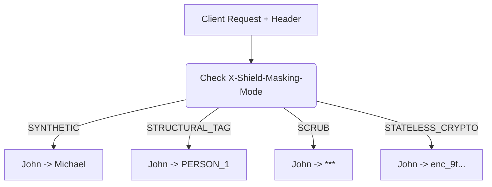

# 4-Mode Per-Request Masking Pipeline

[⬅️ Back to Features Catalog](/docs/features-overview)

## What It Does
The **4-Mode Per-Request Masking Pipeline** empowers client applications to dynamically select their desired redaction strategy on a per-request basis without requiring server restarts. By passing a specific HTTP header, engineers can choose exactly how sensitive data is masked before it hits the LLM.

## How It Works
The proxy intercepts the `X-Shield-Masking-Mode` header and dynamically overrides the global `.env` configuration for the duration of that specific request using thread-safe `contextvars`.

The available modes are:
1. **`SYNTHETIC` (Default):** Replaces detected entities with deterministic, format-aware substitutes (e.g., synthetic SSNs or names) intended to retain useful downstream syntax. Task quality is workload-dependent.
2. **`STRUCTURAL_TAG`:** Replaces entities with explicit, bracketed placeholder tokens (e.g., `[PERSON_1]`, `[EMAIL_1]`). Ideal for legacy compliance pipelines or explicit regex auditing.
3. **`SCRUB`:** Replaces a detected value with `***` and does not create a rehydration mapping for it. Other copies outside this transformation can still exist.
4. **`STATELESS_CRYPTO`:** Secures data in-transit using AES-256-GCM envelope encryption directly within the payload, bypassing the need for Redis storage.

View diagram on GitHub mobile 📱 -->

## Configuration Flags

| Header / Override | Description | Linked Deployment Guide |
| :--- | :--- | :--- |
| `X-Shield-Masking-Mode` | HTTP header to dynamically set the mode (`SYNTHETIC`, `STRUCTURAL_TAG`, `SCRUB`, `STATELESS_CRYPTO`). | [View in POLICIES.md](/docs/policies) |
| `SHIELD_DEFAULT_MASKING_MODE` | The global default mode if the client does not specify the header. | [View in deployment.md](/docs/deployment) |

## Critical Logic & Edge Cases
* **Request isolation:** Overrides use `contextvars.ContextVar` and explicit context propagation. Concurrency tests must cover task creation, background work, cleanup, and exception paths to detect context bleed.
* **Vault Interoperability:** If a request switches to `STATELESS_CRYPTO`, the proxy intelligently bypasses the Redis TTL Vault for that specific payload, avoiding unnecessary network calls.

## FAQ

**Q: Will allowing clients to set this header bypass security?**
A: The header selects a masking representation, while entity selection comes from the active detector/profile configuration. Validate that authentication and policy prevent unauthorized mode changes and test each mode separately; representation can affect downstream schema and rehydration behavior.

**Q: Can I force all clients to use a specific mode and ignore the header?**
A: Yes. You can define a strict `enforced_masking_mode` within `policies.yaml` for a specific security role, which will override and ignore any header supplied by the client application.

**Q: Why use `SCRUB` if it destroys the LLM context?**
A: `SCRUB` replaces a detected value with a short marker and does not support rehydration. Token count and downstream task quality depend on the tokenizer, marker, and workload.

## Plainspeak
This feature lets an authorized caller or policy choose among the supported masking representations. Entity detection, downstream compatibility, and authorization remain separate concerns.

Authorized requests can select among synthetic substitution, structural tags, one-way scrub, and configured cryptographic masking. Policy should restrict which callers may override the default.

## Related Tests
See the following test file for reference implementations and edge-case testing: [`tests/test_pii_engine.py`](https://github.com/ninadphalak/LLM-Shield-Proxy/blob/main/tests/test_pii_engine.py).
