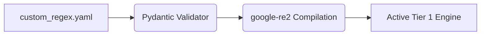

# Bring-Your-Own-Regex (BYOR) Custom Rules

[⬅️ Back to Features Catalog](/docs/features-overview)

## What It Does
**Bring-Your-Own-Regex (BYOR)** loads custom Tier 1 detection rules from YAML. It lets operators
match internal identifiers or other known text shapes without changing the source code.

## How It Works
BYOR patterns are loaded and compiled with the Tier 1 rules. Pattern count, candidate distribution, engine availability, and fallback behavior affect cost; benchmark the configured rule set.

1. **YAML Ingestion:** The proxy reads a mounted `custom_regex.yaml` file during the FastAPI `lifespan` event.
2. **Pydantic Validation:** The loader validates the documented `name`, `pattern`, and optional `description` fields before compilation.
3. **RE2 Compilation:** Supported custom patterns are compiled by `google-re2`, which avoids catastrophic backtracking. Unsupported constructs must be rejected or handled by an explicitly documented fallback.





View diagram on GitHub mobile 📱 -->


## Configuration Flags

| Environment Variable | Description | Linked Deployment Guide |
| :--- | :--- | :--- |
| `CUSTOM_REGEX_PATH` | Absolute path to the YAML file containing custom rules. | [View in deployment.md](/docs/deployment) |

### Configuration Example
```yaml
custom_patterns:
  - name: INTERNAL_PROJECT_CODENAME
    pattern: "(?i)PROJECT-(APOLLO|ZEUS|ARES)-\\d+"
    description: "Matches sensitive internal R&D project codes"
  - name: PROPRIETARY_BILLING_ID
    pattern: "^BILL-[A-Z0-9]{8,12}$"
```

## Critical Logic & Edge Cases
* **Regex Flavor Compatibility:** RE2 does not support constructs such as lookbehind or backreferences. Validate every configured pattern and the behavior used when RE2 is unavailable.
* **Order of Execution:** Custom rules are executed concurrently with the built-in Tier 1 rules. If a custom rule and a built-in rule overlap (e.g., both match a string), the proxy safely tags the string without double-masking.

## FAQ

**Q: What happens if I write a terrible regex like `(a+)+$` in the custom YAML?**
A: The RE2 path rejects unsupported syntax and avoids backtracking-based exponential behavior for accepted patterns. Pattern count, input size, surrounding Python work, and any fallback engine still require load and failure testing.

**Q: Can I hot-reload the `custom_regex.yaml` file without dropping active streams?**
A: Currently, regex compilation is performed at the FastAPI `lifespan` event for maximum performance. To apply new regex rules, the proxy pod must be restarted. (Note: `policies.yaml` RBAC rules *can* be hot-reloaded, but core regex compilation requires a restart).

**Q: How do custom rules interact with Synthetic Masking?**
A: Custom BYOR entities are currently treated as structural strings. If Synthetic Masking is enabled, custom entities will typically be masked using an anonymized hash or generic placeholder unless a specific canonical locale provider is mapped to the custom rule name.


## Practical effect
The built-in patterns cover documented formats such as selected credit-card and email shapes. Custom RE2-compatible rules can add an internal identifier such as `EMP-XYZ-123`; evaluate false positives, false negatives, latency, and reload behavior on a representative corpus.

## Related Tests
See the following test file for reference implementations and edge-case testing: [`tests/test_pii_engine.py`](https://github.com/ninadphalak/LLM-Shield-Proxy/blob/main/tests/test_pii_engine.py).
