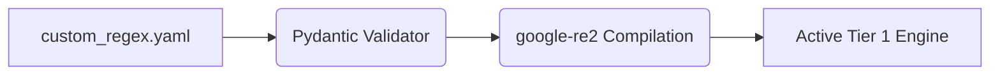

# Bring-Your-Own-Regex (BYOR) Custom Rules

[⬅️ Back to Features Catalog](/docs/features-overview)

## What It Does
**Bring-Your-Own-Regex (BYOR)** enables you to load custom Tier 1 detection rules from a YAML configuration file. This allows operators to match internal identifiers (like employee IDs or project codenames) without modifying the proxy's source code.

## How It Works
Custom patterns are loaded, validated, and compiled alongside the built-in Tier 1 rules. 

1. **YAML Ingestion:** The proxy reads a mounted `custom_regex.yaml` file during startup (FastAPI `lifespan` event).
2. **Validation:** A Pydantic loader validates the `name`, `pattern`, and optional `description` fields.
3. **Compilation:** Supported custom patterns are compiled using `google-re2`, which prevents catastrophic backtracking. Unsupported regex constructs are safely rejected.



## Configuration Flags

| Environment Variable | Description | Linked Guide |
| :--- | :--- | :--- |
| `CUSTOM_REGEX_PATH` | Absolute path to the YAML file containing custom rules. | [View in deployment.md](/docs/deployment) |

### Configuration Example
```yaml
custom_patterns:
  - name: INTERNAL_PROJECT_CODENAME
    pattern: "(?i)PROJECT-(APOLLO|ZEUS|ARES)-\\d+"
    description: "Matches sensitive internal R&D project codes"
  - name: PROPRIETARY_BILLING_ID
    pattern: "^BILL-[A-Z0-9]{8,12}$"
```

## Implementation Details & Edge Cases
* **Regex Flavor Compatibility:** The RE2 engine does not support advanced constructs like lookbehinds or backreferences. Always validate your patterns; unsupported patterns will be rejected.
* **Execution Order:** Custom rules execute concurrently with built-in Tier 1 rules. If an entity matches both a custom rule and a built-in rule, the proxy tags it safely without double-masking.

## FAQ

**Q: What happens if a poorly written regex (e.g., `(a+)+$`) is added to the YAML?**
A: The RE2 engine automatically rejects syntax that can cause backtracking-based exponential slowdowns (ReDoS). However, you should still benchmark your rule set to measure the impact of evaluating a large number of custom patterns.

**Q: Can I hot-reload `custom_regex.yaml` without dropping active streams?**
A: No. Regex compilation occurs at startup for maximum performance. You must restart the proxy pod to apply new regex rules. *(Note: RBAC policies in `policies.yaml` can be hot-reloaded).*

**Q: How do custom rules interact with Synthetic Masking?**
A: BYOR entities default to structural strings. If Synthetic Masking is enabled, they will be masked with an anonymized hash or generic placeholder, unless a specific synthetic locale provider is mapped to the custom rule's name.

## Practical Effect
While built-in patterns cover standard formats (like credit cards and emails), BYOR rules allow you to seamlessly redact proprietary data formats. When adding custom rules, be sure to evaluate them for false positives, false negatives, and latency against a representative dataset.

## Related Tests
Tests: [`tests/test_pii_engine.py`](https://github.com/ninadphalak/LLM-Shield-Proxy/blob/main/tests/test_pii_engine.py).
