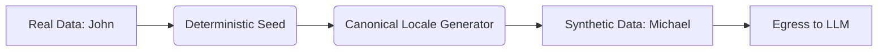

# Format-Preserving Synthetic Masking & Entropy

[⬅️ Back to Features Catalog](/docs/features-overview)

## What It Does
**Synthetic masking** replaces a detected value with a deterministic, format-aware substitute
instead of a bracketed tag. For example, it can replace a name with another name or an SSN-shaped
value with a reserved synthetic value. The substitute is not proof of a valid or issued identity.

> [!TIP]
> **Wondering what specific types of data are detected?** Check out the [Supported PII & Sensitive Data Types](supported-pii-types.md) feature guide for an exhaustive list.

## How It Works
Structural tags and realistic substitutes can affect tokenization and model output differently.
The proxy offers synthetic masking so operators can test a format-aware option:
1. **Deterministic Mapping:** Within the documented mapping scope, the same detected value is intended to receive the same substitute. Verify scope and multi-replica behavior for the selected vault mode.
2. **Coherent Substitution:** Rather than generic structural strings, the underlying generation logic respects mathematical formats and regional locales:
   - **Credit Cards:** A real Visa card number is swapped with a validly checksummed (Luhn algorithm) synthetic Visa card number.
   - **Emails:** A real email like `alex.smith@company.com` is swapped with a syntactically correct placeholder like `johndoe@fictional.net`.
   - **SSNs / Phone Numbers:** A detected value can be replaced with a format-aware synthetic value. A realistic format does not make the substitute a valid or issued identifier.
   *(Tier 1/2 target configured structured formats and entropy candidates; semantic entities such as personal names require an enabled and validated [Tier 3 NLP model](../../deployment.md#advanced-feature-flags-compliance-security-and-engineering). Each tier can produce false positives and false negatives.)*
3. **Supported rehydration:** When a returned synthetic token matches a retained mapping on the inspected response path, the sliding window can replace it with the original value. Transformed, truncated, or out-of-scope output may not match.

View diagram on GitHub mobile 📱 -->

## Configuration Flags

| Environment Variable | Description | Linked Deployment Guide |
| :--- | :--- | :--- |
| `ENABLE_SYNTHETIC_SWAPPING` | Toggles between Synthetic Masking (`true`) and Structural Tagging (`false`). | [View in deployment.md](/docs/deployment) |

## Critical Logic & Edge Cases
* **Referential Consistency:** Repeated values can map to the same substitute within the configured scope. That can preserve some relationships, but it does not establish unchanged model reasoning or output quality.
* **Stream fragmentation:** Because synthetic substitutes are unbracketed, ambiguous overlaps and collisions require explicit fixtures. The buffer tests registered mappings across fragmented delivery; it does not establish universal natural-language matching.

## FAQ

**Q: Can I turn off synthetic masking and use standard bracket tags for auditing?**
A: Set `ENABLE_SYNTHETIC_SWAPPING=false` to select structural tags such as `[PERSON_1]`. Confirm the effective setting at startup and test client/model handling of those tags.

**Q: Does generating synthetic data slow down the request?**
A: Generation and vault lookup add work. Repeated values can reuse a stored mapping within its
scope, but latency depends on the vault, number of entities, payload, and concurrency. Measure the
configured mode.

## Practical effect
This feature replaces detected data with format-aware synthetic values.

Short structural markers and realistic-looking substitutes can affect models differently. Synthetic mode is intended to retain some surface format, but accuracy, privacy, token use, and task quality must be compared on representative fixtures.

## Related Tests
Tests: [`tests/test_pii_engine.py`](https://github.com/ninadphalak/LLM-Shield-Proxy/blob/main/tests/test_pii_engine.py).
