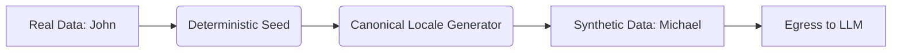

# Format-Preserving Synthetic Masking & Entropy

[⬅️ Back to Features Catalog](/docs/features-overview)

## What It Does
**Synthetic Masking** replaces detected sensitive data with deterministic, format-aware substitutes instead of explicit tags (like `[EMAIL_1]`). For example, it replaces a real name with a synthetic name, or a real SSN with a structurally valid, reserved synthetic SSN.

> [!TIP]
> **Wondering what specific types of data are detected?** Check out the [Supported PII Types](supported-pii-types.md) guide for an exhaustive list.

## How It Works
Explicit tags (like `[EMAIL_1]`) can confuse tokenizers or alter model behavior. Synthetic masking provides a format-aware alternative that preserves the text's natural structure:

1. **Deterministic Mapping:** Within a configured scope, a detected value is consistently mapped to the same synthetic substitute. This preserves relationships (e.g., distinguishing between two different users in a conversation) without exposing real data.
2. **Coherent Substitution:** Substitutes respect mathematical formats and regional locales:
   - **Credit Cards:** A real Visa number is swapped with a synthetic, Luhn-valid Visa number.
   - **Emails:** `alex.smith@company.com` is swapped with a syntactically correct placeholder like `johndoe@fictional.net`.
   - **SSNs / Phone Numbers:** Replaced with structurally accurate synthetic values. *(Note: A realistic format does not mean the substitute is a valid or issued identifier).*
3. **Rehydration:** When the model outputs the synthetic token, the proxy intercepts it on the return path. If the token matches a retained mapping in the Vault, the proxy transparently restores the original value before sending the response to the client.

## Configuration Flags

| Environment Variable | Description | Linked Guide |
| :--- | :--- | :--- |
| `ENABLE_SYNTHETIC_SWAPPING` | Toggles between Synthetic Masking (`true`) and Structural Tagging (`false`). | [View in deployment.md](/docs/deployment) |

## Implementation Details & Edge Cases
* **Referential Consistency:** Mapping consistency is scoped to the specific request or vault configuration. While it preserves basic relationships in the text, it does not guarantee unchanged model reasoning.
* **Stream Fragmentation:** Because synthetic substitutes lack explicit brackets (unlike `[TAGS]`), detecting them in fragmented SSE streams requires precise sliding window buffers. The proxy handles this transparently, but explicitly overlapping language tokens can cause edge cases.

## FAQ

**Q: Can I turn off synthetic masking and use standard bracket tags instead?**
A: Yes. Set `ENABLE_SYNTHETIC_SWAPPING=false` to use structural tags like `[EMAIL_1]`. This is often preferred for rigid auditing scenarios where you want explicitly marked redactions.

**Q: Does generating synthetic data slow down the request?**
A: Generating synthetic data and performing Vault lookups adds minor overhead. Latency depends on the number of detected entities, payload size, and vault concurrency. You should benchmark the configured mode in your environment.

## Practical Effect
This feature replaces sensitive data with realistic, format-aware synthetic values. This often improves the grammatical coherence of LLM outputs compared to explicit tags. However, you should compare both modes on representative workloads to evaluate token usage, task quality, and downstream compatibility.

## Related Tests
Tests: [`tests/test_pii_engine.py`](https://github.com/ninadphalak/LLM-Shield-Proxy/blob/main/tests/test_pii_engine.py).
