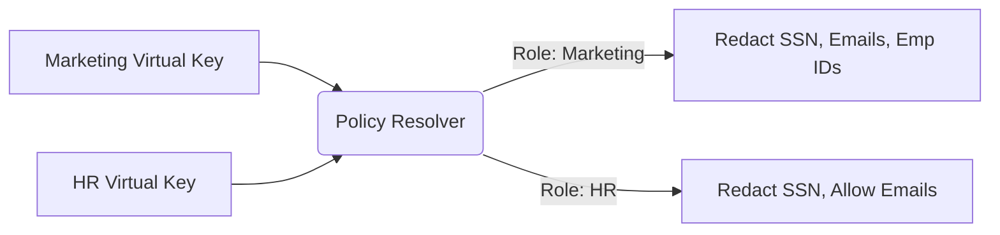

# Granular Entity Policy Scopes

[⬅️ Back to Features Catalog](/docs/features-overview)

## What It Does
**Granular Entity Policy Scopes** allow enterprise administrators to define highly specific, department-level Data Loss Prevention (DLP) rules. Instead of applying a blanket "redact everything" policy, you can configure the proxy so that the HR department's LLM agent can process employee IDs and salaries, while the Marketing department's agent automatically redacts them.

## How It Works
The proxy maps incoming API keys to security roles using an O(1) in-memory flattening architecture.

1. **Virtual Key Ingress:** Client applications authenticate using a `virtual_key_id` instead of an actual OpenAI key.
2. **Policy Resolution:** The proxy looks up the virtual key in the loaded `policies.yaml` file to determine the assigned security role (e.g., `role_hr_admin` or `role_marketing_contractor`).
3. **Scoped Enforcement:** The cascade engine (Tiers 1, 2, and 3) applies only the redaction entities defined in that specific role's scope.

View diagram on GitHub mobile 📱 -->

## Configuration Flags

| File / Config | Description | Linked Deployment Guide |
| :--- | :--- | :--- |
| `policies.yaml` | The YAML file defining roles and their associated entity scopes. | [View in POLICIES.md](/docs/policies) |

## Critical Logic & Edge Cases
* **Zero-Trust Default (FAIL_CLOSED):** If a `virtual_key_id` is not found, or if a role is improperly defined without explicit `allowed_entities`, the proxy defaults to redacting *everything* recognized by the cascade engines to prevent accidental exfiltration.
* **Role Inheritance:** Policies support hierarchical inheritance, allowing a `role_global_admin` to inherit base scopes while appending new permissions without duplicating YAML blocks.

## FAQ

**Q: Can I apply policies based on the user's IP address instead of their API key?**
A: Currently, policy resolution is strictly tied to the `virtual_key_id` (via the `Authorization` header) as this maps cleanly to identity providers and service accounts in Zero Trust architectures.

**Q: How fast is the policy lookup? Will it slow down my requests if I have 10,000 users?**
A: The active mapping uses dictionary lookup after policy flattening, but total request cost includes identity resolution, reloads, detector work, and policy processing. Measure the actual policy sizes and concurrency profile rather than asserting identical timing.

**Q: If a user sends a custom regex pattern in their prompt, does it bypass the scope?**
A: The resolved policy controls the supported transformation path. Identity mapping, resolver defaults, bypass routes, unsupported payloads, and failure behavior must be tested separately.

## Plainspeak
This feature lets operators assign different configured entity scopes to different identities. The policy design and validation remain the operator's responsibility.

For example, HR and Marketing can be assigned different entity rules. The proxy resolves the supplied tenant/key through the configured policy source and applies the resulting profile on supported paths. Unknown-key and resolver-failure behavior must be tested for each resolver; not every path shares the same default.

## Related Tests
See the following test file for reference implementations and edge-case testing: [`tests/test_policy_scopes.py`](https://github.com/ninadphalak/LLM-Shield-Proxy/blob/main/tests/test_policy_scopes.py).
