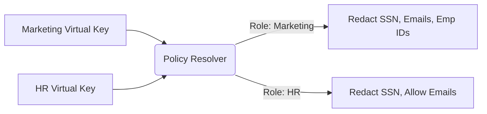

# Granular Entity Policy Scopes

[⬅️ Back to Features Catalog](/docs/features-overview)

## What It Does
**Entity Policy Scopes** allow you to apply different redaction rules based on the user's assigned role. For instance, you can configure HR administrators to see employee IDs, while restricting marketing contractors from seeing those same IDs. The proxy dynamically enforces these scopes based on the authenticated identity.

## How It Works
The proxy maps incoming virtual keys to specific roles defined in `policies.yaml` and applies the corresponding entity scopes.

1. **Virtual Key Ingress:** Client applications authenticate using a `virtual_key_id` instead of a raw OpenAI/Anthropic API key.
2. **Policy Resolution:** The proxy looks up the virtual key in `policies.yaml` to determine the assigned security role (e.g., `role_hr_admin` or `role_marketing_contractor`).
3. **Scoped Enforcement:** The redaction engine (Tiers 1, 2, and 3) applies only the entity rules explicitly defined within that role's scope.

## Configuration Flags

| File / Config | Description | Linked Guide |
| :--- | :--- | :--- |
| `policies.yaml` | The YAML file defining roles and their associated entity scopes. | [View in POLICIES.md](/docs/policies) |

## Implementation Details & Edge Cases
* **Unknown Key Behavior:** If `FAIL_CLOSED` is enabled, any request with an unknown `virtual_key_id` is rejected outright. If the resolved role does not explicitly list `allowed_entities`, the proxy defaults to redacting *every* entity it can detect.
* **Role Inheritance:** `policies.yaml` supports hierarchical inheritance. A `role_global_admin` can inherit base scopes while appending additional permissions, avoiding redundant YAML configuration.

## FAQ

**Q: Can I apply policies based on the user's IP address instead of their API key?**
A: No. The proxy resolves policies strictly based on the `virtual_key_id` provided in the authorization headers. 

**Q: Does policy lookup add significant latency?**
A: Policy maps are flattened in memory during startup, meaning lookups are extremely fast. However, overall request cost still depends on detector workloads and payload size. You should measure performance under your expected concurrency profile.

**Q: If a user sends a custom regex pattern in their prompt, does it bypass the scope?**
A: The resolved policy exclusively controls the proxy's transformation path. The proxy inspects the payload regardless of what the user includes in their prompt. 

## Practical Effect
This feature allows you to strictly segment data visibility across different organizational roles using a single centralized gateway. HR, engineering, and marketing teams can share the same LLM infrastructure without violating data privacy policies.

## Related Tests
Tests: [`tests/test_policy_scopes.py`](https://github.com/ninadphalak/LLM-Shield-Proxy/blob/main/tests/test_policy_scopes.py).
