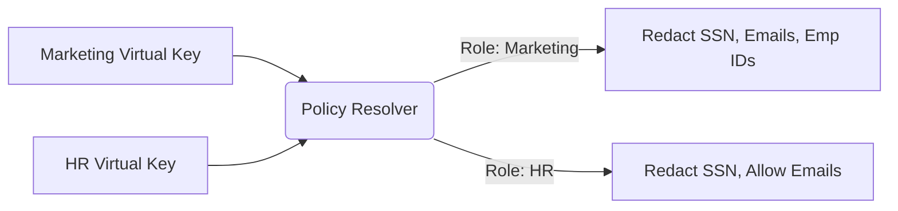

# Granular Entity Policy Scopes

[⬅️ Back to Features Catalog](/docs/features-overview)

## What It Does
**Granular Entity Policy Scopes** allow enterprise administrators to define highly specific, department-level Data Loss Prevention (DLP) rules. Instead of applying a blanket "redact everything" policy, you can configure the proxy so that the HR department's LLM agent can process employee IDs and salaries, while the Marketing department's agent automatically redacts them.

## How It Works
The proxy maps incoming API keys to security roles using an O(1) in-memory flattening architecture.

1. **Virtual Key Ingress:** Client applications authenticate using a `virtual_key_id` instead of an actual OpenAI key.
2. **Policy Resolution:** The proxy looks up the virtual key in the loaded `policies.yaml` file to determine the assigned security role (e.g., `role_hr_admin` or `role_marketing_contractor`).
3. **Scoped Enforcement:** The cascade engine (Tiers 1, 2, and 3) applies only the redaction entities defined in that specific role's scope.

View diagram on GitHub mobile 📱 -->

## Configuration Flags

| File / Config | Description | Linked Deployment Guide |
| :--- | :--- | :--- |
| `policies.yaml` | The YAML file defining roles and their associated entity scopes. | [View in POLICIES.md](/docs/policies) |

## Critical Logic & Edge Cases
* **Zero-Trust Default (FAIL_CLOSED):** If a `virtual_key_id` is not found, or if a role is improperly defined without explicit `allowed_entities`, the proxy defaults to redacting *everything* recognized by the cascade engines to prevent accidental exfiltration.
* **Role Inheritance:** Policies support hierarchical inheritance, allowing a `role_global_admin` to inherit base scopes while appending new permissions without duplicating YAML blocks.

## FAQ

**Q: Can I apply policies based on the user's IP address instead of their API key?**
A: Currently, policy resolution is strictly tied to the `virtual_key_id` (via the `Authorization` header) as this maps cleanly to identity providers and service accounts in Zero Trust architectures.

**Q: How fast is the policy lookup? Will it slow down my requests if I have 10,000 users?**
A: The lookup takes microseconds. The `policies.yaml` file is flattened into an O(1) hash map in memory upon startup. Evaluating 10,000 rules takes exactly the same time as evaluating 1 rule.

**Q: If a user sends a custom regex pattern in their prompt, does it bypass the scope?**
A: No. The proxy's redaction scopes apply to the data *exiting* your VPC. The user's prompt is completely subjugated to the policy assigned to their virtual key, regardless of what instructions they pass to the LLM.

## Plainspeak
This feature ensures that different departments have exactly the right level of data security tailored to their needs, rather than using a one-size-fits-all approach.

For example, the HR department's AI might be allowed to see employee names, but the Marketing department's AI should definitely not. This feature creates specific "ID badges" (profiles) for different teams. When a team uses the system, it instantly checks their badge and strictly applies their custom rules, defaulting to blocking everything if it's ever unsure.

## Related Tests
See the following test file for reference implementations and edge-case testing: [`tests/test_policy_scopes.py`](https://github.com/YOUR_ORG/LLM-Shield-Proxy/blob/main/tests/test_policy_scopes.py).
