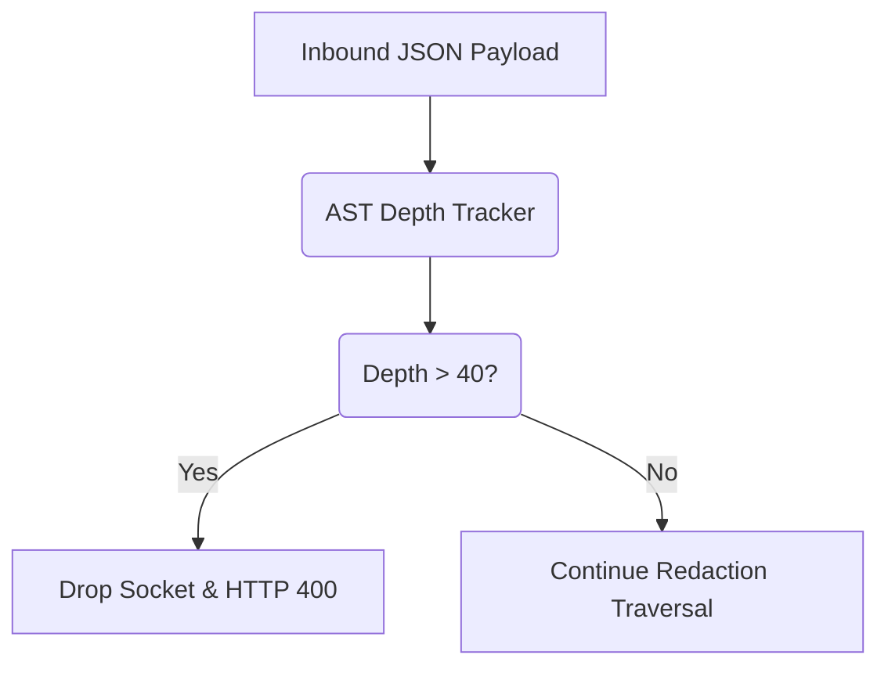

# JSON Bomb / Payload Nesting Depth Protection

[⬅️ Back to Features Catalog](/docs/features-overview)

## What It Does
The **JSON depth limit** rejects supported payloads whose parsed nesting exceeds the configured maximum. It reduces one stack and CPU exhaustion risk but does not cover payload size, width, strings, compression, concurrency, or parser work performed before the check.

## How It Works
When the proxy intercepts a request, it must traverse the JSON payload to find strings requiring redaction (especially within `messages` arrays or `tool_calls`).

1. **Streaming Lexer Interception:** As the Rust-backed `orjson` parser deserializes the payload, the proxy tracks the recursive depth of the Abstract Syntax Tree (AST).
2. **Hard-Capped Traversal:** The engine enforces a strict recursive depth limit (`max_depth = 40` by default).
3. **Bounded Rejection:** If the parser detects an object or array nesting level exceeding this limit, traversal halts and the proxy returns HTTP `400 Bad Request`.

View diagram on GitHub mobile 📱 -->

## Performance Profile
- **Performance:** Workload and environment dependent; measure this path under the published benchmark protocol.
- **Overhead:** Protects the Python event loop from blocking recursively, ensuring multi-tenant proxy stability.

## Configuration Flags
The depth limit bounds one parser dimension. Payload size, string length, concurrency, detector cost, and downstream processing require separate limits and tests.

| Internal Constant | Description |
| :--- | :--- |
| `AST_MAX_DEPTH` | Maximum allowed recursive JSON depth (default: 40). |

## Critical Logic & Edge Cases
* **Tool-Call Preservation:** Legitimate autonomous agent workflows (like AutoGen) can generate heavily nested arguments. A depth of 40 comfortably accommodates massive, legitimate schemas (which rarely exceed depth 10) while effectively neutralizing malicious `{"a":{"a":{"a":...}}}` payloads.
* **Immediate Socket Severing:** Because the proxy operates as a stream interceptor, exceeding the depth limit triggers a hard socket drop before the payload is ever forwarded to OpenAI or Anthropic, protecting your upstream billing quotas.

## FAQ

**Q: Has a legitimate LangChain or MCP payload ever hit the depth limit of 40?**
A: No. Standard OpenAI schemas, even with complex nested tool arguments and multi-modal message arrays, rarely exceed a depth of 15. A depth of 40 is exclusively reached by malfunctioning code or intentional algorithmic complexity attacks.

**Q: Does this protect against massive strings (megabytes of text) as well?**
A: Depth protection addresses nesting only. Apply payload and line-size limits, validate RE2 and fallback behavior, and measure memory and CPU under the intended concurrency.

**Q: Does this reject the request before or after authentication?**
A: On the main HTTP path, authentication is evaluated before application JSON parsing. The ASGI server, middleware, headers, body receive path, and infrastructure still perform work, so enforce ingress body, header, connection, timeout, and rate limits too.

## Plainspeak
This feature acts as a safety limit against overwhelming the system with overly complex data.

Deeply nested JSON can consume parser and traversal resources. The configured depth check rejects payloads beyond its supported boundary; combine it with body-size, line-size, timeout, concurrency, and infrastructure limits.

## Related Tests
See the following test file for reference implementations and edge-case testing: [`tests/test_security_hardening.py`](https://github.com/ninadphalak/LLM-Shield-Proxy/blob/main/tests/test_security_hardening.py).
