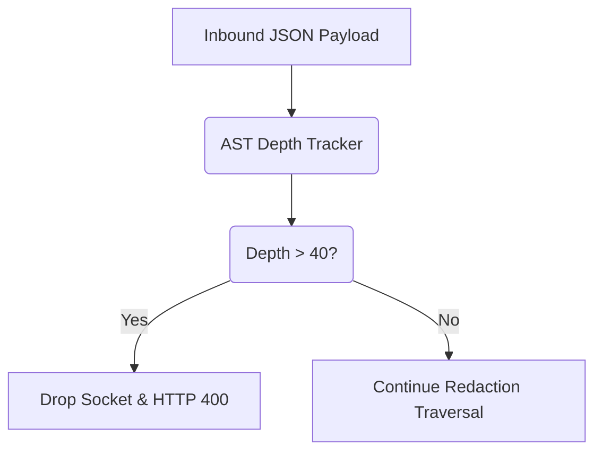

# JSON Bomb / Payload Nesting Depth Protection

[⬅️ Back to Features Catalog](/docs/features-overview)

## What It Does
The **JSON Bomb Protection** feature is an adversarial defense mechanism that prevents stack overflow attacks and CPU exhaustion caused by maliciously crafted, infinitely nested JSON payloads. It hardens the proxy against Denial of Service (DoS) attacks targeting the AST-aware lexer.

## How It Works
When the proxy intercepts a request, it must traverse the JSON payload to find strings requiring redaction (especially within `messages` arrays or `tool_calls`).

1. **Streaming Lexer Interception:** As the Rust-backed `orjson` parser deserializes the payload, the proxy tracks the recursive depth of the Abstract Syntax Tree (AST).
2. **Hard-Capped Traversal:** The engine enforces a strict recursive depth limit (`max_depth = 40` by default).
3. **Instant Rejection:** If the parser detects an object or array nesting level exceeding this limit, the traversal immediately halts, and the proxy drops the connection, returning an HTTP `400 Bad Request` to the client in `&lt;1ms`.

View diagram on GitHub mobile 📱 -->

## Performance Profile
- **Execution Speed:** Depth checking is O(1) per node and adds negligible overhead to the standard parsing pass.
- **Overhead:** Protects the Python event loop from blocking recursively, ensuring multi-tenant proxy stability.

## Configuration Flags
The depth limit is fundamentally embedded in the streaming lexer's defense architecture to guarantee stability.

| Internal Constant | Description |
| :--- | :--- |
| `MAX_JSON_DEPTH` | Internal hard cap for recursive traversal (default: 40). |

## Critical Logic & Edge Cases
* **Tool-Call Preservation:** Legitimate autonomous agent workflows (like AutoGen) can generate heavily nested arguments. A depth of 40 comfortably accommodates massive, legitimate schemas (which rarely exceed depth 10) while effectively neutralizing malicious `{"a":{"a":{"a":...}}}` payloads.
* **Immediate Socket Severing:** Because the proxy operates as a stream interceptor, exceeding the depth limit triggers a hard socket drop before the payload is ever forwarded to OpenAI or Anthropic, protecting your upstream billing quotas.

## FAQ

**Q: Has a legitimate LangChain or MCP payload ever hit the depth limit of 40?**
A: No. Standard OpenAI schemas, even with complex nested tool arguments and multi-modal message arrays, rarely exceed a depth of 15. A depth of 40 is exclusively reached by malfunctioning code or intentional algorithmic complexity attacks.

**Q: Does this protect against massive strings (megabytes of text) as well?**
A: Depth protection handles recursion. For massive strings, the proxy relies on the O(N) guarantees of the Tier 1 regex engine and `MAX_SSE_LINE_LENGTH` stream limits to prevent buffer overflow attacks.

**Q: Does this reject the request before or after authentication?**
A: After. The payload is only parsed if the client's `Authorization` header is successfully resolved to a valid `virtual_key_id`. This prevents unauthenticated attackers from expending CPU cycles on the parser.

## Plainspeak
This feature acts as a safety limit against overwhelming the system with overly complex data.

Hackers sometimes try to crash servers by sending data that has layers inside layers inside layers (like a billion Russian nesting dolls). If the computer tries to open them all, it runs out of memory and crashes. This feature strictly enforces a limit on how many layers deep the data can go, instantly blocking any "data bombs" before they cause harm.

## Related Tests
See the following test file for reference implementations and edge-case testing: [`tests/test_security_hardening.py`](https://github.com/YOUR_ORG/LLM-Shield-Proxy/blob/main/tests/test_security_hardening.py).
