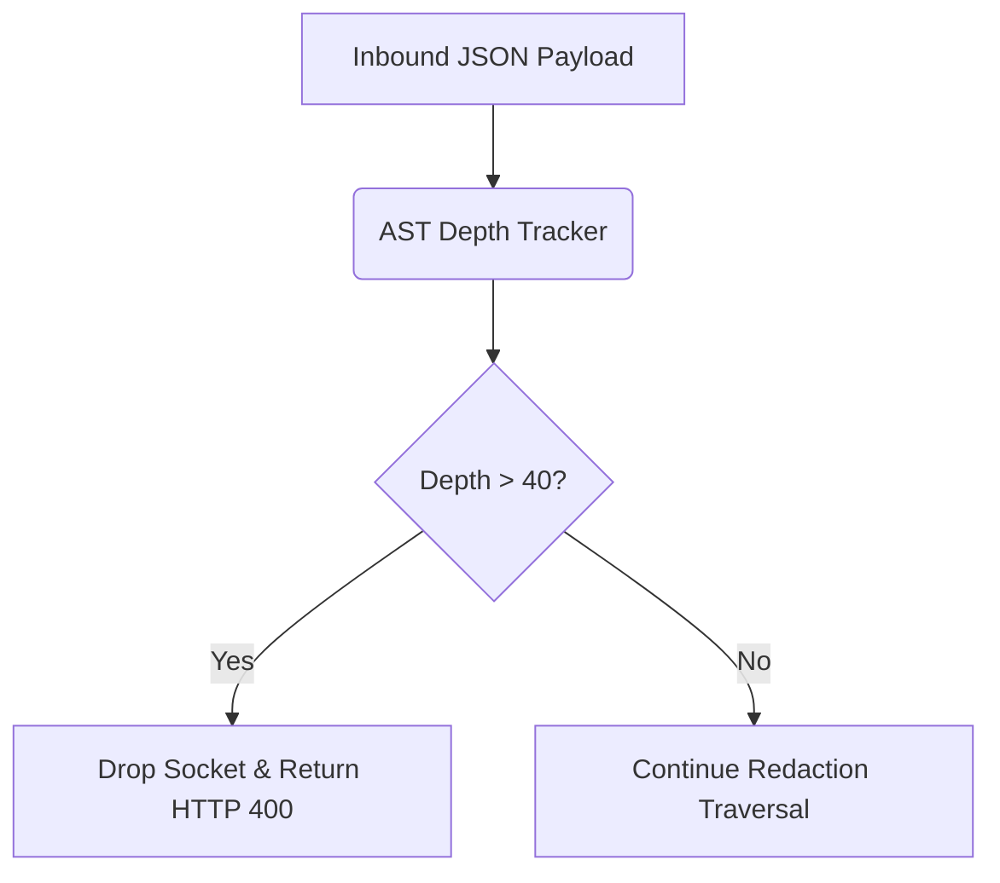

# JSON Bomb / Payload Nesting Depth Protection

[⬅️ Back to Features Catalog](/docs/features-overview)

## What It Does
The **JSON Depth Limit** protects the proxy from deeply nested JSON payloads ("JSON bombs"). By strictly capping recursive traversal depth, it reduces the risk of stack overflow and CPU exhaustion attacks. Note that this feature specifically limits *nesting depth*-it does not limit total payload size, string length, or concurrency.

## How It Works
The proxy inspects JSON payloads to locate strings that require redaction (e.g., within `messages` arrays or `tool_calls`). 

1. **Streaming Lexer Interception:** As the Rust-backed `orjson` parser deserializes the payload, the proxy tracks the recursive depth of the Abstract Syntax Tree (AST).
2. **Hard-Capped Traversal:** The engine enforces a strict recursive depth limit (default: 40).
3. **Bounded Rejection:** If the parser detects nesting that exceeds this limit, traversal halts immediately and the proxy returns an HTTP `400 Bad Request`.

## Performance Profile
- **Performance:** Evaluation overhead is highly dependent on the workload. Measure this path under your specific benchmark protocol.
- **Overhead:** The proxy must parse and traverse enough of the payload to enforce the limit. While this check mitigates deep-recursion risks, it does not guarantee absolute service stability against all DoS vectors.

## Configuration Flags

| Internal Constant | Description |
| :--- | :--- |
| `AST_MAX_DEPTH` | Maximum allowed recursive JSON depth (default: 40). |

## Implementation Details & Edge Cases
* **Legitimate Nesting:** Complex agentic workflows (like MCP tool arguments) can produce deeply nested schemas. Always test the depth limit against your specific clients and models; a depth of 40 is a reasonable default, but may not accommodate all valid use cases.
* **Rejection Point:** If a payload exceeds the limit, the proxy returns a 400 error *before* forwarding the request upstream. However, remember that the underlying ASGI server and middleware have already consumed some resources to receive the payload.

## FAQ

**Q: Have legitimate LangChain or MCP payloads hit the depth limit of 40?**
A: It is possible depending on how deeply the client nests tool schemas. We strongly recommend measuring the maximum depth of your production payloads and adjusting `AST_MAX_DEPTH` with ample headroom for future schema expansions.

**Q: Does this feature also block massive strings (e.g., megabytes of text)?**
A: No. Depth protection strictly addresses JSON nesting. You must implement separate limits for body size, connection timeouts, and concurrency to fully protect the gateway.

**Q: Does this reject malicious payloads before authentication?**
A: No. On the standard HTTP path, authentication evaluates *before* JSON body parsing begins. The infrastructure still performs work to establish the connection and authenticate the request.

## Practical Effect
This protection acts as a safeguard against malicious or poorly formed JSON that aims to crash the parser via recursive stack exhaustion. For comprehensive protection, operators must combine this with standard WAF policies like body-size and line-size limits.

## Related Tests
Tests: [`tests/test_security_hardening.py`](https://github.com/ninadphalak/LLM-Shield-Proxy/blob/main/tests/test_security_hardening.py).
