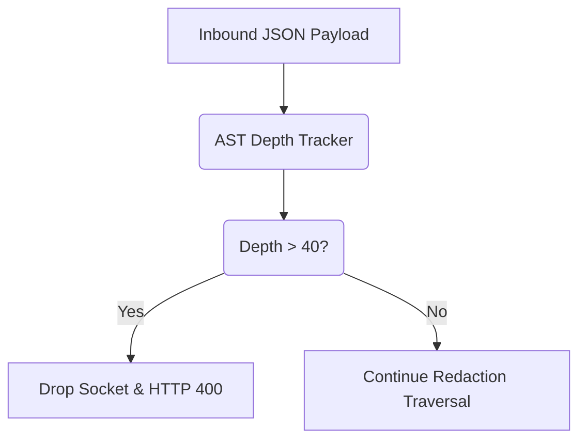

# JSON Bomb / Payload Nesting Depth Protection

[⬅️ Back to Features Catalog](/docs/features-overview)

## What It Does
The **JSON depth limit** rejects supported payloads whose parsed nesting exceeds the configured maximum. It reduces one stack and CPU exhaustion risk but does not cover payload size, width, strings, compression, concurrency, or parser work performed before the check.

## How It Works
When the proxy intercepts a request, it must traverse the JSON payload to find strings requiring redaction (especially within `messages` arrays or `tool_calls`).

1. **Streaming Lexer Interception:** As the Rust-backed `orjson` parser deserializes the payload, the proxy tracks the recursive depth of the Abstract Syntax Tree (AST).
2. **Hard-Capped Traversal:** The engine enforces a strict recursive depth limit (`max_depth = 40` by default).
3. **Bounded Rejection:** If the parser detects an object or array nesting level exceeding this limit, traversal halts and the proxy returns HTTP `400 Bad Request`.

View diagram on GitHub mobile 📱 -->

## Performance Profile
- **Performance:** Workload and environment dependent; measure this path under the published benchmark protocol.
- **Overhead:** The proxy must parse and traverse enough of the payload to enforce the limit. The
  check reduces deep-recursion risk but does not guarantee service stability.

## Configuration Flags
The depth limit bounds one parser dimension. Payload size, string length, concurrency, detector cost, and downstream processing require separate limits and tests.

| Internal Constant | Description |
| :--- | :--- |
| `AST_MAX_DEPTH` | Maximum allowed recursive JSON depth (default: 40). |

## Critical Logic & Edge Cases
* **Legitimate nesting:** Complex tool arguments can be deeply nested. Test the limit against the
  actual schemas used by clients; the project does not claim that depth 40 fits every valid input.
* **Rejection point:** An over-limit request returns HTTP 400 before upstream forwarding on the
  supported path. The server and middleware have already done some parsing and receive work.

## FAQ

**Q: Has a legitimate LangChain or MCP payload ever hit the depth limit of 40?**
A: The project does not have evidence for every LangChain, MCP, or multimodal schema. Measure the
maximum depth of the payloads you accept and set the limit with room for expected changes.

**Q: Does this protect against massive strings (megabytes of text) as well?**
A: Depth protection addresses nesting only. Apply payload and line-size limits, validate RE2 and fallback behavior, and measure memory and CPU under the intended concurrency.

**Q: Does this reject the request before or after authentication?**
A: On the main HTTP path, authentication is evaluated before application JSON parsing. The ASGI server, middleware, headers, body receive path, and infrastructure still perform work, so enforce ingress body, header, connection, timeout, and rate limits too.

## Practical effect
Deeply nested JSON can consume parser and traversal resources. The configured depth check rejects payloads beyond its supported boundary; combine it with body-size, line-size, timeout, concurrency, and infrastructure limits.

## Related Tests
See the following test file for reference implementations and edge-case testing: [`tests/test_security_hardening.py`](https://github.com/ninadphalak/LLM-Shield-Proxy/blob/main/tests/test_security_hardening.py).
