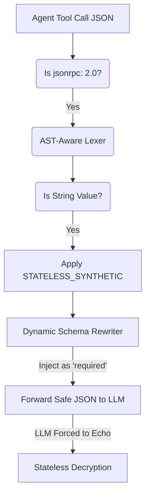

# Stateless AST-Aware Semantic PII Firewall

[⬅️ Back to Features Catalog](../../../features-overview.md)

## What It Does
The **Stateless AST-Aware Semantic PII Firewall** extends the proxy's redaction capabilities beyond basic text prompts and directly into autonomous agent workflows. It intercepts and safely mutates structured tool invocations (such as JSON-RPC 2.0 payloads or MCP protocol commands) to ensure agents do not leak sensitive PII when executing backend tools like `exec_sql` or `fetch_profile`.

## How It Works
When LangChain, AutoGen, or an MCP client issues a tool call, the payload is often deeply nested JSON. Standard regex filters corrupt JSON structure by blindly replacing text.

1. **Auto-Detection & Override:** The proxy inspects incoming payloads for the `"jsonrpc": "2.0"` signature (or MCP protocol headers). When detected, it strictly bypasses the user's standard text masking configuration (e.g., `SYNTHETIC` or Redis vaults) to prevent JSON breakage.
2. **AST-Aware Traversal:** The engine uses a zero-allocation streaming lexer (`orjson`) to parse the Abstract Syntax Tree (AST) of the payload, specifically targeting `tool_calls[*].function.arguments`. It runs the 3-Tier cascade (Regex, Entropy, NER) on the extracted values. *(See [Supported PII Types](supported-pii-types.md) for an exhaustive list).*
3. **Dynamic Schema Rewriting (The "Force Echo" Mechanism):** When PII is detected, the engine applies `STATELESS_SYNTHETIC` to create a reversible cipher. To avoid breaking the LLM's attention weights, it replaces the JSON string with a structurally coherent **canonical locale** synthetic token. Crucially, to guarantee the LLM retains the true encrypted state, the proxy intercepts the OpenAI/MCP tool schema on the fly. It injects a `_ctx_hash_<prop>` sibling field directly into the schema's `properties` map, and appends it to the `required` array.
4. **Stateless Rehydration:** Because the injected cipher-context field is now legally `required` by the JSON Schema, the downstream LLM is mathematically forced by its own output-parser to echo the hidden field back in its response. The proxy decrypts this in-band data instantly upon return, granting infinite horizontal scalability across load balancers with zero Redis dependency.

View diagram on GitHub mobile 📱 -->

## Performance Profile
- **Execution Speed:** Sub-millisecond JSON traversal.
- **Overhead:** Hard-capped max depth traversal guarantees latency remains flat even against adversarial payloads.

## Plainspeak: The "Robotic Arm"
This feature is the structural parser for *machine-to-machine* code.

When autonomous AI agents communicate with each other or use tools (via MCP or JSON-RPC), they don't send plain text. They send deeply nested JSON code (e.g., `{"tool_calls": [{"arguments": "{\"cc_num\": \"1234\"}"}]}`). If you use a standard proxy to blindly search and replace text inside that raw JSON string, you will accidentally break quotation marks or escape characters, causing a fatal error and crashing the AI agent.

The Semantic Firewall acts like a surgical **"Robotic Arm"**. It perfectly parses the JSON code, reaches deep into the nested layers to find the sensitive data, and *then* it applies the redaction (like Cryptographic Masking) to just that specific value. It does all of this without corrupting the underlying JSON structure.

## Critical Logic & Edge Cases
* **JSON Bomb (Slowloris) Defense:** To prevent attackers from submitting infinitely nested JSON objects to exhaust CPU recursion limits, the firewall enforces a strict `max_depth = 40`. Any payload exceeding this is instantly rejected with a `400 Bad Request`.
* **Schema Integrity:** By mutating only primitive string values and utilizing `_ctx_hash` fields, the proxy ensures Pydantic validators on the client side continue to pass successfully.

## FAQ

**Q: Will this corrupt my strict OpenAI Structured Outputs (JSON Schema)?**
A: No. The firewall replaces PII with Format-Preserving Synthetic Masking (e.g., swapping a real email for a fake one). Because the data type (string) and the format (email) remain identical, strict JSON Schema validation will continue to succeed flawlessly.

**Q: Why are `_ctx_hash_<prop>` fields injected into my schema?**
A: This is the mechanism for stateless synthetic. By injecting the AES-256-GCM encrypted original value into a sibling field, the proxy can re-hydrate the real value when the tool executes on your backend, completely eliminating the need for the proxy to store your data in a database.

## Plainspeak
This feature acts as a smart translator between an AI agent and the tools it uses (like a database or a calculator).

When an AI wants to use a tool, it sends instructions in a specific computer format (called JSON). If we just blindly blacked-out sensitive words in those instructions, it would break the formatting and cause the tool to crash. Instead, this firewall carefully unpackages the instructions, hides only the sensitive data while keeping the structure intact, and then seamlessly repackages it so the tool still works perfectly.

## Related Tests
See the following test file for reference implementations and edge-case testing: [`tests/test_tool_rbac_and_compliance.py`](../../../tests/test_tool_rbac_and_compliance.py).
