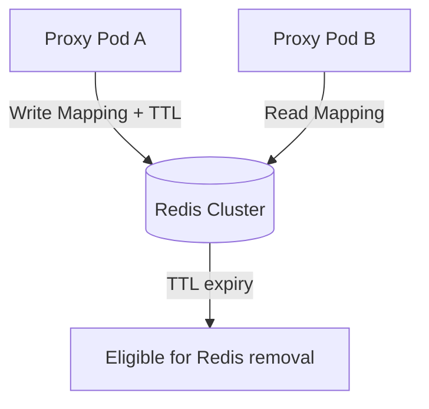

# Stateless Redis TTL Vault

[⬅️ Back to Features Catalog](/docs/features-overview)

## What It Does
The Redis TTL vault provides a shared mapping store for configured proxy replicas. Expiration makes records eligible for removal according to Redis behavior and deployment settings; it does not prove secure erasure from memory, persistence files, replicas, backups, or snapshots.

## How It Works
The vault uses `redis.asyncio` to manage ephemeral state without blocking the Python event loop.

1. **Deterministic Hashing:** When PII is identified (e.g., "John Doe"), the vault generates a deterministic HMAC-SHA256 hash using the session's Virtual Key. This hash acts as the Redis lookup key.
2. **TTL expiry:** Saved mappings use Redis `SETEX`, and vault retrieval refreshes the key's expiry. Redis removes expired keys according to its expiry behavior; persistence, replicas, backups, and memory reclamation have separate boundaries.
3. **Cross-Pod access:** Replicas using the same Redis data, namespace, identity/session keys, and compatible configuration can retrieve the same mapping. Actual routing and isolation require deployment tests.

View diagram on GitHub mobile 📱 -->

## Performance Profile
- **Performance:** Workload and environment dependent; measure this path under the published benchmark protocol.
- **Overhead:** Uses Redis connection pooling to maintain persistent sockets and avoid TCP handshake latency.

## Configuration Flags

| Environment Variable | Description | Linked Deployment Guide |
| :--- | :--- | :--- |
| `REDIS_URL` | The connection string for the Redis cluster. | [View in deployment.md](/docs/deployment) |
| `SESSION_TTL_SECONDS` | Duration before the vault automatically evicts session data (default 3600). | [View in deployment.md](/docs/deployment) |

## Critical Logic & Edge Cases
* **Redis failure:** Health and request behavior depend on the selected probe, masking mode, failure policy, cache state, and timing. Test partitions and timeouts explicitly; do not assume an automatic fallback unless the active code path and policy demonstrate it.
* **Namespace isolation:** Tenant/session material participates in key construction on documented paths. Add cross-tenant tests and protect Redis credentials, key prefixes, encryption/HMAC keys, and administrative access; naming alone is not an isolation boundary.

## FAQ

**Q: Do I *have* to use Redis to run the proxy?**
A: No. A single process can use its in-memory mapping store, and `STATELESS_CRYPTO` avoids a mapping store for supported flows. Multi-replica synthetic or structural-tag rehydration requires shared or sticky state and must be tested for routing and expiry.

**Q: What happens if a user stream takes longer than `SESSION_TTL_SECONDS`?**
A: The Redis TTL is refreshed when the vault is retrieved and when updated mappings are saved, not on every response chunk. Test long streams and routing behavior with the selected TTL.

**Q: Are the original PII strings stored in Redis?**
A: Yes, mapping values contain originals. Protect Redis with network controls, authentication, TLS, least privilege, and appropriate storage encryption; a VPC boundary alone is insufficient.

## Plainspeak
This feature provides a shared, TTL-bounded mapping store whose security depends on Redis and infrastructure configuration.

The Redis mode stores a temporary mapping from a substitute to the original value with a configured TTL. Expiry makes the key eligible for deletion; memory reclamation, persistence files, replicas, backups, snapshots, swap, and crash dumps depend on Redis and infrastructure configuration.

## Related Tests
See the following test file for reference implementations and edge-case testing: [`tests/test_vault.py`](https://github.com/ninadphalak/LLM-Shield-Proxy/blob/main/tests/test_vault.py).
