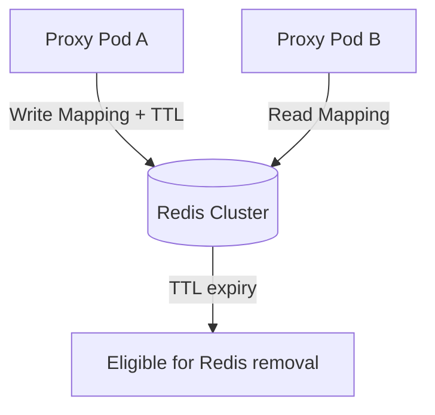

# Redis TTL Mapping Store

[⬅️ Back to Features Catalog](/docs/features-overview)

## What It Does
The Redis TTL Vault provides a shared, ephemeral mapping store for stateful redaction modes (like Synthetic Masking or Structural Tagging). It maps the temporary substitute tokens back to the original plaintext so the proxy can transparently restore the data on the return path. 

Data automatically expires based on the configured Time-To-Live (TTL).

## How It Works
The vault uses `redis.asyncio` to manage ephemeral state without blocking the Python event loop, allowing high-throughput concurrent processing.

1. **Deterministic Hashing:** When sensitive data is identified, the vault generates a deterministic HMAC-SHA256 hash using the session's Virtual Key. This hash acts as the Redis lookup key.
2. **TTL Expiry:** Mappings are saved using the Redis `SETEX` command. The TTL is refreshed whenever a mapping is retrieved or updated. Redis automatically evicts expired keys.
3. **Cross-Pod Access:** In a multi-replica deployment, all proxy instances connected to the same Redis cluster can read and write to the same namespace, ensuring seamless rehydration even if the response lands on a different pod than the request.

## Performance Profile
- **Latency Overhead:** The vault uses Redis connection pooling to maintain persistent sockets and avoid TCP handshake overhead on every request. Measure latency in your specific environment under expected loads.

## Configuration Flags

| Environment Variable | Description | Linked Guide |
| :--- | :--- | :--- |
| `REDIS_URL` | The connection string for the Redis cluster. | [View in deployment.md](/docs/deployment) |
| `SESSION_TTL_SECONDS` | Duration before the vault automatically evicts session data (default 3600). | [View in deployment.md](/docs/deployment) |

## Implementation Details & Edge Cases
* **Redis Failure:** If Redis becomes partitioned or times out, the proxy's behavior depends on your failure policy settings. Do not assume an automatic bypass or fail-open state unless explicitly configured and tested.
* **Data Expiry Boundaries:** While Redis TTL handles cache eviction, it does not guarantee cryptographic erasure from disk persistence (AOF/RDB), replica nodes, or memory dumps. 

## FAQ

**Q: Do I have to use Redis to run the proxy?**
A: No. A single-process deployment can use an in-memory mapping store. Additionally, `STATELESS_CRYPTO` mode completely bypasses mapping stores. However, if you want synthetic swapping or structural tags across multiple load-balanced pods, you need shared state via Redis.

**Q: What happens if a user stream takes longer than `SESSION_TTL_SECONDS`?**
A: The TTL is refreshed when the vault is retrieved and when updated mappings are saved. If a stream sits completely idle longer than the TTL before the model responds with the token, the mapping will expire and rehydration will fail.

**Q: Are the original PII strings stored in Redis?**
A: Yes, the mapping values contain the original plaintext. You must secure your Redis cluster using network isolation (VPC), strong authentication, TLS in-transit, and storage encryption.

## Practical Effect
This feature enables multi-node scalability for stateful redaction modes, backed by an auto-expiring datastore. Security relies heavily on your infrastructure's Redis configuration.

## Related Tests
Tests: [`tests/test_vault.py`](https://github.com/ninadphalak/LLM-Shield-Proxy/blob/main/tests/test_vault.py).
