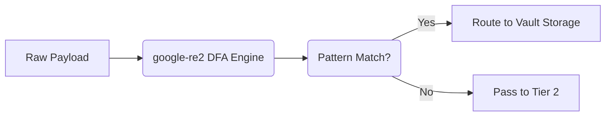

# Tier 1 Pre-Compiled Regex Engine

[⬅️ Back to Features Catalog](/docs/features-overview)

## What It Does
The **Tier 1 Regex Engine** applies precompiled regular expressions to detect structured sensitive data, such as SSNs, email addresses, credit card numbers, and custom identifier shapes. It intercepts and redacts matches before the request is forwarded to the upstream LLM.

## How It Works
The proxy leverages **`google-re2`**, a regular expression engine that guarantees linear-time execution, strictly avoiding the catastrophic backtracking vulnerabilities inherent to standard regex engines.

1. **Startup Compilation:** During the FastAPI `lifespan` startup event, all predefined PII patterns and user-supplied custom regexes are compiled down into Deterministic Finite Automatons (DFAs).
2. **Safe Execution:** The `google-re2` engine executes matches without backtracking.
3. **Bounded Pattern Language:** To guarantee safety, RE2 rejects complex features like lookbehinds and backreferences. Unsupported constructs will fail to compile.



## Configuration Flags
The engine operates automatically but can be extended using the Bring-Your-Own-Regex (BYOR) feature.

| Environment Variable | Description | Linked Guide |
| :--- | :--- | :--- |
| `CUSTOM_REGEX_PATH` | Path to a YAML file containing custom regex rules to inject into Tier 1. | [View in deployment.md](/docs/deployment) |

### BYOR Example (`custom_regex.yaml`)
```yaml
custom_patterns:
  - name: INTERNAL_EMPLOYEE_ID
    pattern: "(?i)EMP-[A-Z]{3}-\\d{5}"
    description: "Matches internal Acme Corp employee IDs"
```

## Implementation Details & Edge Cases
* **Streaming Fragmentation:** The `SSERehydrationBuffer` maintains a bounded suffix to properly reassemble and rehydrate tokens that get split across multiple Server-Sent Events (SSE) chunks.
* **Text Boundaries:** Matching relies on explicit ASCII-alphanumeric boundary rules. You must validate the behavior on CJK (Chinese, Japanese, Korean) or other script types that do not rely on standard spaces.
* **Validation Limits:** Formatting anomalies (like missing separators in phone numbers) or minor typos in credit cards (which fail Luhn checksums) do not prevent redaction. The proxy prioritizes safe over-redaction (false positives) over data leaks (false negatives). See [Supported PII Types](supported-pii-types.md).

## FAQ

**Q: Can I use lookaheads or lookbehinds in my custom regex?**
A: No. RE2 explicitly rejects lookbehinds and backreferences to guarantee linear execution time. If your rule requires unsupported context, redesign the rule or evaluate using the Tier 3 NER model instead.

**Q: Does injecting thousands of custom regexes slow down the proxy?**
A: Yes. While RE2 avoids catastrophic backtracking, evaluating thousands of rules still increases CPU overhead and memory footprint. Always benchmark your configured rules under load.

## Practical Effect
Tier 1 efficiently and safely identifies structured text shapes without exposing the proxy to ReDoS (Regular Expression Denial of Service) attacks. It forms the high-speed baseline for the redaction cascade.

## Related Tests
Tests: [`tests/test_pii_engine.py`](https://github.com/ninadphalak/LLM-Shield-Proxy/blob/main/tests/test_pii_engine.py).
