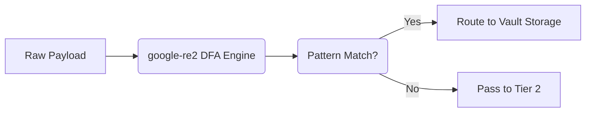

# Tier 1 Pre-Compiled Regex Engine

[⬅️ Back to Features Catalog](/docs/features-overview)

## What It Does
The **Tier 1 Pre-Compiled Regex Engine** is the foundational layer of the LLM-Shield-Proxy's 3-Tier Redaction Cascade. It is designed to rapidly and deterministically identify structured sensitive data (e.g., SSNs, Emails, Credit Card Numbers, and Custom Corporate Identifiers) using pre-compiled regular expressions, ensuring they are redacted before they leave your VPC.

## How It Works
Unlike traditional proxies that evaluate regular expressions dynamically at runtime using standard backtracking engines (like Python's `re` module), LLM-Shield-Proxy utilizes the **`google-re2` C++ engine**.

1. **Startup Compilation:** During the FastAPI `lifespan` startup event, all predefined PII patterns and user-supplied custom regexes are compiled down into Deterministic Finite Automatons (DFAs).
2. **Non-backtracking engine:** Supported patterns use RE2, avoiding catastrophic backtracking behavior.
3. **Bounded pattern language:** Unsupported constructs are rejected by RE2. Pattern count, input size, fallback behavior, and surrounding processing remain part of the resource model.





View diagram on GitHub mobile 📱 -->


## Performance Profile
- **Performance:** Workload and environment dependent; measure this path under the published benchmark protocol.
- **Overhead:** Depends on input size, configured patterns, runtime, and concurrency. Measure it with the selected service-level workload.

## Configuration Flags
The engine operates automatically, but can be extended via the Bring-Your-Own-Regex (BYOR) feature.

| Environment Variable | Description | Linked Deployment Guide |
| :--- | :--- | :--- |
| `CUSTOM_REGEX_PATH` | Path to a YAML file containing custom regex rules to inject into Tier 1. | [View in deployment.md](/docs/deployment) |

### BYOR Example (`custom_regex.yaml`)
```yaml
custom_patterns:
  - name: INTERNAL_EMPLOYEE_ID
    pattern: "(?i)EMP-[A-Z]{3}-\\d{5}"
    description: "Matches internal Acme Corp employee IDs"
```

## Critical Logic & Edge Cases
* **Streaming Fragmentation:** The engine is tightly coupled with the `SSERehydrationBuffer`, ensuring that regexes safely evaluate across split Server-Sent Event (SSE) chunks by maintaining a prefix-overlap window.
* **Non-Latin Scripts:** For CJK (Chinese, Japanese, Korean) texts where spaces are absent, the Tier 1 engine avoids catastrophic sub-word collisions by isolating ASCII alphanumeric boundaries securely.

## FAQ

**Q: Can I use lookaheads or lookbehinds in my custom regex?**
A: RE2 does not support lookbehind or backreferences. If a rule needs unsupported context, redesign the rule or evaluate the optional NER tier; do not silently change engines.

**Q: Does injecting thousands of custom regexes slow down the proxy?**
A: No. The `re2` engine compiles them into a highly optimized state machine. While startup time might marginally increase, runtime matching remains practically constant-time and ultra-low latency.

## Plainspeak
This feature quickly scans text for sensitive information like Social Security Numbers and email addresses using pre-defined search patterns (like a highly advanced "CTRL+F").

RE2 avoids the catastrophic-backtracking failure mode found in some regex engines. It does not remove other CPU, memory, input-size, concurrency, or integration risks.

## Related Tests
See the following test file for reference implementations and edge-case testing: [`tests/test_pii_engine.py`](https://github.com/ninadphalak/LLM-Shield-Proxy/blob/main/tests/test_pii_engine.py).
