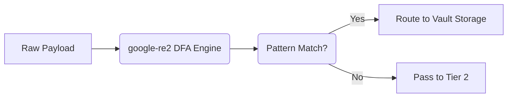

# Tier 1 Pre-Compiled Regex Engine

[⬅️ Back to Features Catalog](/docs/features-overview)

## What It Does
The **Tier 1 Regex Engine** applies precompiled patterns to supported structured data such as SSN,
email, card-number, and custom identifier shapes. A match is redacted on the supported request
path before the upstream request is built.

## How It Works
The proxy compiles supported patterns with **`google-re2`** at startup. RE2 does not use
backtracking, but it also rejects features such as lookbehind and backreferences.

1. **Startup Compilation:** During the FastAPI `lifespan` startup event, all predefined PII patterns and user-supplied custom regexes are compiled down into Deterministic Finite Automatons (DFAs).
2. **Non-backtracking engine:** Supported patterns use RE2, avoiding catastrophic backtracking behavior.
3. **Bounded pattern language:** Unsupported constructs are rejected by RE2. Pattern count, input size, fallback behavior, and surrounding processing remain part of the resource model.





View diagram on GitHub mobile 📱 -->


## Performance Profile
- **Performance:** Workload and environment dependent; measure this path under the published benchmark protocol.
- **Overhead:** Depends on input size, configured patterns, runtime, and concurrency. Measure it with the selected service-level workload.

## Configuration Flags
The engine operates automatically, but can be extended via the Bring-Your-Own-Regex (BYOR) feature.

| Environment Variable | Description | Linked Deployment Guide |
| :--- | :--- | :--- |
| `CUSTOM_REGEX_PATH` | Path to a YAML file containing custom regex rules to inject into Tier 1. | [View in deployment.md](/docs/deployment) |

### BYOR Example (`custom_regex.yaml`)
```yaml
custom_patterns:
  - name: INTERNAL_EMPLOYEE_ID
    pattern: "(?i)EMP-[A-Z]{3}-\\d{5}"
    description: "Matches internal Acme Corp employee IDs"
```

## Critical Logic & Edge Cases
* **Streaming fragmentation:** `SSERehydrationBuffer` keeps a bounded suffix so it can reassemble
  registered replacement tokens split across SSE chunks.
* **Text boundaries:** Matching and rehydration use explicit ASCII-alphanumeric boundary rules.
  Test CJK and other text without spaces against the exact configured patterns.
* **Validation does not reject native card or phone matches.** Issuer prefixes and Luhn affect an
  internal card-confidence value only. A finite issuer list can miss private-label or new cards,
  and a typo can make a real card fail Luhn. Phone formatting is not used to reject a match because
  an international number may contain no separator. The documented 22-string business corpus
  therefore retains 17 matched strings and 18 spans. Custom BYOR patterns receive no structural
  validation. See [Supported PII types](supported-pii-types.md#validation-is-a-signal-not-a-gate).

## FAQ

**Q: Can I use lookaheads or lookbehinds in my custom regex?**
A: RE2 does not support lookbehind or backreferences. If a rule needs unsupported context, redesign the rule or evaluate the optional NER tier; do not silently change engines.

**Q: Does injecting thousands of custom regexes slow down the proxy?**
A: More rules increase compilation, matching, and memory work. RE2 avoids catastrophic
backtracking for supported patterns, but performance still depends on rule count, pattern shape,
input size, and concurrency. Benchmark the configured rules.

## Practical effect
Tier 1 finds configured text shapes such as SSNs and email addresses. RE2 avoids catastrophic
backtracking for supported patterns. It does not remove other CPU, memory, input-size,
concurrency, or integration risks.

## Related Tests
Tests: [`tests/test_pii_engine.py`](https://github.com/ninadphalak/LLM-Shield-Proxy/blob/main/tests/test_pii_engine.py).
