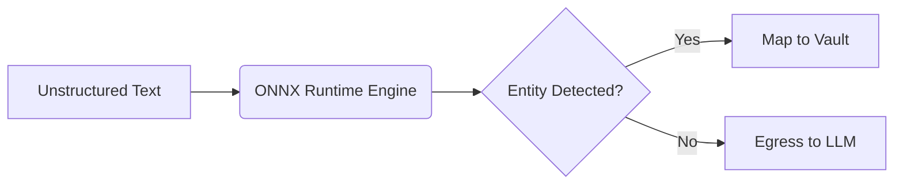

# Tier 3 Quantized ONNX BERT-NER

[⬅️ Back to Features Catalog](/docs/features-overview)

## What It Does
The **Tier 3 Quantized ONNX BERT-NER** is the contextual layer of the redaction cascade. While Tier 1 and 2 rely on rigid structures and entropy, Tier 3 uses an operator-supplied Named Entity Recognition (NER) model to understand natural language context. This allows it to identify conversational entities like `PERSON`, `ORGANIZATION`, and `LOCATION`.

## How It Works
Tier 3 executes model inference locally within the proxy using ONNX Runtime, ensuring no data leaves the environment.

1. **Quantization:** Operators can deploy quantized models to drastically reduce memory footprint and inference latency, though accuracy metrics (F1/recall) should be thoroughly tested.
2. **ONNX Runtime Execution:** Inference is delegated to the highly optimized ONNX Runtime engine.
3. **Lazy Loading:** The model is strictly opt-in. If Tier 3 is disabled, the model is never loaded into memory, saving resources.

## Configuration Flags

| Environment Variable | Description | Linked Guide |
| :--- | :--- | :--- |
| `ENABLE_TIER3_ONNX_NER` | Enables the optional ONNX entity model. Defaults to `false`. | [View in deployment.md](/docs/deployment) |
| `ONNX_MODEL_PATH` | Path to a custom quantized Hugging Face ONNX model and tokenizer. | [View in deployment.md](/docs/deployment) |

## Implementation Details & Edge Cases
* **Non-Latin Scripts:** Languages lacking standard whitespace boundaries (e.g., CJK scripts) require specific tokenizer testing. Validate your exact model and script behavior thoroughly.
* **Strict Fallback Policy:** If `ONNX_MODEL_PATH` is missing but Tier 3 is enabled, the proxy **does not** fall back to heuristics (which historically caused catastrophic false positives). It will simply log a warning and fail to redact contextual entities.

## FAQ

**Q: Can I use my own domain-specific model for Medical records (HIPAA)?**
A: Yes. You can supply any compatible ONNX model and tokenizer via `ONNX_MODEL_PATH`. However, ensure your Hugging Face export maintains compatible input and label shapes before relying on it for regulated data.

**Q: Does enabling this break the microsecond streaming latency?**
A: Yes, adding a neural network introduces model and hardware-dependent inference latency. You should benchmark the exact ONNX file under your expected payload concurrency to establish realistic p95/p99 latency Service Level Objectives (SLOs).

## Practical Effect
Tier 3 provides semantic understanding, allowing the proxy to differentiate between a person's name and a brand name based on sentence structure. Operators must carefully select, quantize, and validate the model to balance accuracy and performance.

## Related Tests
Tests: [`tests/test_pii_engine.py`](https://github.com/ninadphalak/LLM-Shield-Proxy/blob/main/tests/test_pii_engine.py).
