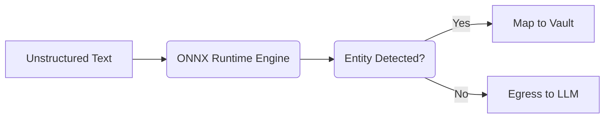

# Tier 3 Quantized ONNX BERT-NER

[⬅️ Back to Features Catalog](../../../features-overview.md)

## What It Does
The **Tier 3 Quantized ONNX BERT-NER** is the final, most sophisticated layer of the 3-Tier cascade. While Tier 1 and Tier 2 handle structured patterns and secrets, Tier 3 uses Deep Learning for contextual free-text extraction. It identifies conversational PII (e.g., Patient Names, Organization Names, and Locations) buried in unstructured paragraphs, ensuring strict HIPAA and GDPR compliance for healthcare and legal workloads.

## How It Works
Traditional NLP libraries (like spaCy, PyTorch, or Transformers) consume 1GB+ of RAM and add 100ms+ of latency, destroying real-time AI streaming. LLM-Shield-Proxy solves this by utilizing the **C++ ONNX Runtime**.

1. **Quantization:** The BERT-NER transformer weights are heavily quantized, drastically reducing memory footprint while maintaining >95% F1 Recall.
2. **Native Execution:** The model executes natively in-memory via the ONNX runtime, entirely bypassing the Python Global Interpreter Lock (GIL).
3. **Lazy-Loading:** The neural pipeline is strictly lazy-loaded. If disabled, it gracefully bypasses neural inference with zero startup overhead, keeping the proxy's baseline memory strictly under `&lt;85 MB`.

View diagram on GitHub mobile 📱 -->

## Performance Profile
- **Execution Speed:** `~12.50 ms` median latency per 50-token chunk inference.
- **Overhead:** Adds ~45MB to the resident RAM footprint when enabled.

## Configuration Flags

| Environment Variable | Description | Linked Deployment Guide |
| :--- | :--- | :--- |
| `ENABLE_TIER3_ONNX_NER` | Toggles deep neural entity extraction. Defaults to `false` for maximum speed. | [View in deployment.md](../../deployment.md) |
| `ONNX_MODEL_PATH` | Path to a custom quantized Hugging Face ONNX model and tokenizer. | [View in deployment.md](../../deployment.md) |

## Critical Logic & Edge Cases
* **Script-Aware Non-Latin & CJK Rehydration:** Standard word boundaries (spaces) break in logographic scripts (Chinese, Japanese, Korean). The engine isolates ASCII boundaries securely while treating CJK ideographs continuously to prevent sub-word stream corruption.
* **Fallback Heuristics:** If `ONNX_MODEL_PATH` is not set but Tier 3 is enabled, it gracefully falls back to heuristic keyword detection.

## FAQ

**Q: Can I use my own domain-specific model for Medical records (HIPAA)?**
A: Yes! This is the "Bring Your Own Model" (BYOM) feature. You can export any Hugging Face model (e.g., BioBERT, ClinicalBERT) to ONNX, point `ONNX_MODEL_PATH` to the directory, and the proxy will use it for contextual extraction.

**Q: Does enabling this break the microsecond streaming latency?**
A: It adds roughly 12ms of latency to chunks containing entities. While slightly slower than the microsecond Tier 1/2 engines, 12ms is entirely imperceptible to humans during a live Server-Sent Events (SSE) stream, maintaining the real-time UX.

## Plainspeak
This feature is a highly efficient artificial intelligence reader. Instead of just looking for strict patterns like 9-digit numbers, it actually reads the surrounding sentence to understand the context.

For example, it can tell the difference between "Call Mr. Ford" (a person's name) and "I drive a Ford" (a car brand). To ensure it runs lightning-fast without slowing down your system, the AI model has been stripped down to its essential math (quantized) and runs directly in the computer's memory.

## Related Tests
See the following test file for reference implementations and edge-case testing: [`tests/test_pii_engine.py`](../../../tests/test_pii_engine.py).
