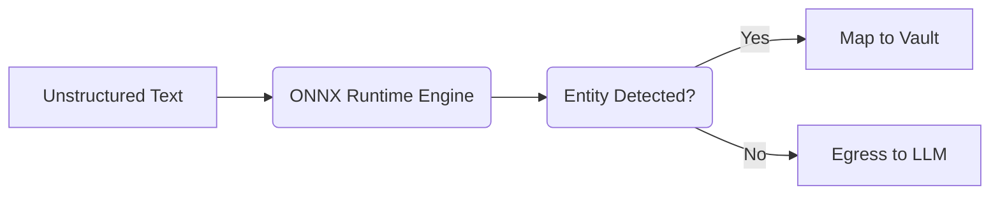

# Tier 3 Quantized ONNX BERT-NER

[⬅️ Back to Features Catalog](/docs/features-overview)

## What It Does
The **Tier 3 Quantized ONNX BERT-NER** is the optional contextual layer of the cascade. While Tier 1 and Tier 2 handle structured patterns and secret candidates, Tier 3 can identify selected conversational entities using an operator-supplied model. This may support HIPAA/GDPR safeguards; accuracy and compliance depend on the model, corpus, configuration, and surrounding program.

## How It Works
Contextual entity models add deployment-specific memory and inference cost. This optional tier uses ONNX Runtime so operators can select and benchmark a local model that fits their accuracy and resource requirements.

1. **Quantization:** Quantized weights can reduce model size and inference cost. F1/recall must be reported for the exact model, labeled corpus, split, and threshold; the project does not currently claim a universal `>95%` value.
2. **ONNX Runtime execution:** Model inference is delegated to ONNX Runtime. Python preprocessing, postprocessing, allocation, and orchestration still execute in the Python process; measure concurrency rather than assuming the GIL is irrelevant.
3. **Lazy loading:** If the tier is disabled, its model is not loaded. Measure RSS and latency with the exact enabled model and runtime.

View diagram on GitHub mobile 📱 -->

## Performance Profile
- **Execution speed:** Model, hardware, input, batching, and runtime dependent.
- **Memory:** Report peak RSS for the exact model artifact and deployment configuration.

## Configuration Flags

| Environment Variable | Description | Linked Deployment Guide |
| :--- | :--- | :--- |
| `ENABLE_TIER3_ONNX_NER` | Enables the optional ONNX entity model. Defaults to `false`. | [View in deployment.md](/docs/deployment) |
| `ONNX_MODEL_PATH` | Path to a custom quantized Hugging Face ONNX model and tokenizer. | [View in deployment.md](/docs/deployment) |

## Critical Logic & Edge Cases
* **Non-Latin and CJK text:** Languages without spaces need different boundary tests. Validate
  detection and rehydration with the exact model, tokenizer, script, and streaming format.
* **Fallback:** If `ONNX_MODEL_PATH` is missing while Tier 3 is enabled, the current path falls
  back to heuristic detection. Treat that as reduced coverage and monitor it explicitly.

## FAQ

**Q: Can I use my own domain-specific model for Medical records (HIPAA)?**
A: You can supply a compatible ONNX model and tokenizer through `ONNX_MODEL_PATH`. The current
runtime path expects a compatible input and label shape; not every Hugging Face export works.
Test the exported model before using it for medical data.

**Q: Does enabling this break the microsecond streaming latency?**
A: It adds model- and host-dependent inference time. Benchmark the exact ONNX file, provider, payload distribution, and concurrency, and report service-level p50/p95/p99.

## Practical effect
Depending on the selected model and training data, contextual inference may distinguish uses such as a person's name from a brand. Quantization can reduce model size and change accuracy and latency; publish the model, corpus, thresholds, and measurements for any quality claim.

## Related Tests
Tests: [`tests/test_pii_engine.py`](https://github.com/ninadphalak/LLM-Shield-Proxy/blob/main/tests/test_pii_engine.py).
