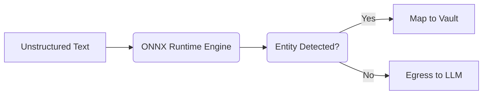

# Tier 3 Quantized ONNX BERT-NER

[⬅️ Back to Features Catalog](/docs/features-overview)

## What It Does
The **Tier 3 Quantized ONNX BERT-NER** is the optional contextual layer of the cascade. While Tier 1 and Tier 2 handle structured patterns and secret candidates, Tier 3 can identify selected conversational entities using an operator-supplied model. This may support HIPAA/GDPR safeguards; accuracy and compliance depend on the model, corpus, configuration, and surrounding program.

## How It Works
Contextual entity models add deployment-specific memory and inference cost. This optional tier uses ONNX Runtime so operators can select and benchmark a local model that fits their accuracy and resource requirements.

1. **Quantization:** Quantized weights can reduce model size and inference cost. F1/recall must be reported for the exact model, labeled corpus, split, and threshold; the project does not currently claim a universal `>95%` value.
2. **Native Execution:** The model executes natively in-memory via the ONNX runtime, entirely bypassing the Python Global Interpreter Lock (GIL).
3. **Lazy loading:** If the tier is disabled, its model is not loaded. Measure RSS and latency with the exact enabled model and runtime.

View diagram on GitHub mobile 📱 -->

## Performance Profile
- **Execution speed:** Model, hardware, input, batching, and runtime dependent.
- **Memory:** Report peak RSS for the exact model artifact and deployment configuration.

## Configuration Flags

| Environment Variable | Description | Linked Deployment Guide |
| :--- | :--- | :--- |
| `ENABLE_TIER3_ONNX_NER` | Toggles deep neural entity extraction. Defaults to `false` for maximum speed. | [View in deployment.md](/docs/deployment) |
| `ONNX_MODEL_PATH` | Path to a custom quantized Hugging Face ONNX model and tokenizer. | [View in deployment.md](/docs/deployment) |

## Critical Logic & Edge Cases
* **Script-Aware Non-Latin & CJK Rehydration:** Standard word boundaries (spaces) break in logographic scripts (Chinese, Japanese, Korean). The engine isolates ASCII boundaries securely while treating CJK ideographs continuously to prevent sub-word stream corruption.
* **Fallback Heuristics:** If `ONNX_MODEL_PATH` is not set but Tier 3 is enabled, it gracefully falls back to heuristic keyword detection.

## FAQ

**Q: Can I use my own domain-specific model for Medical records (HIPAA)?**
A: Yes! This is the "Bring Your Own Model" (BYOM) feature. You can export any Hugging Face model (e.g., BioBERT, ClinicalBERT) to ONNX, point `ONNX_MODEL_PATH` to the directory, and the proxy will use it for contextual extraction.

**Q: Does enabling this break the microsecond streaming latency?**
A: It adds model- and host-dependent inference time. Benchmark the exact ONNX file, provider, payload distribution, and concurrency, and report service-level p50/p95/p99.

## Plainspeak
This feature is a highly efficient artificial intelligence reader. Instead of just looking for strict patterns like 9-digit numbers, it actually reads the surrounding sentence to understand the context.

For example, it can tell the difference between "Call Mr. Ford" (a person's name) and "I drive a Ford" (a car brand). To ensure it runs lightning-fast without slowing down your system, the AI model has been stripped down to its essential math (quantized) and runs directly in the computer's memory.

## Related Tests
See the following test file for reference implementations and edge-case testing: [`tests/test_pii_engine.py`](https://github.com/YOUR_ORG/LLM-Shield-Proxy/blob/main/tests/test_pii_engine.py).
