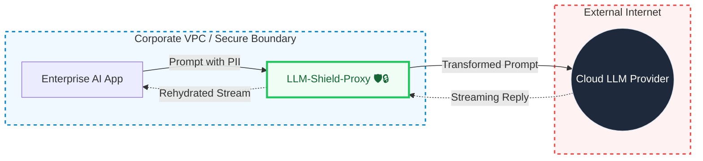
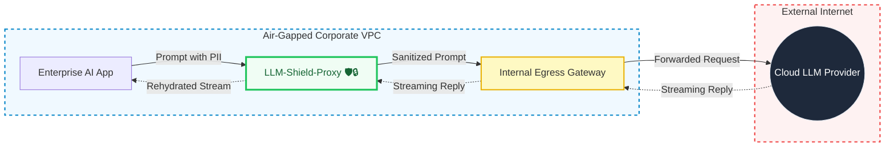

# Deployment Topologies

LLM-Shield-Proxy can sit between an application and an LLM provider. It transforms detected values
before the configured upstream request and can restore mapped values on supported response paths.
Detection is not complete, so network policy and deployment tests must enforce the intended egress
boundary.

The diagrams below show two common deployment topologies.

---

## 1. Standard Egress to Cloud LLM

The application sends supported requests to the proxy inside the private network. The proxy applies
the configured detection and masking rules, then sends the transformed request to the provider.

### Setup Instructions
1. Deploy `LLM-Shield-Proxy` inside your VPC (e.g., via Kubernetes or Docker Compose).
2. Ensure the proxy has outbound NAT access to reach the Cloud LLM provider (e.g., `api.openai.com`).
3. Configure your AI applications to point their `base_url` to the internal proxy endpoint instead of the public LLM endpoint.

---

## 2. Internal egress gateway

For organizations whose workload network policy denies direct internet egress, LLM-Shield-Proxy can route its configured upstream client through an internal egress gateway such as Squid, Envoy, or a corporate proxy. Enforce and test the deny policy outside the application as well.

### Setup Instructions
1. Deploy `LLM-Shield-Proxy` alongside your application.
2. Enable `AIR_GAPPED_MODE` and set `EGRESS_GATEWAY_URL` to the internal gateway.
3. Use firewall and DNS policy to block direct internet routes from the proxy.
4. Test every enabled provider, adapter, telemetry path, model download, update path, and failure
   path. The application setting alone does not prove an air gap or regulatory compliance.
