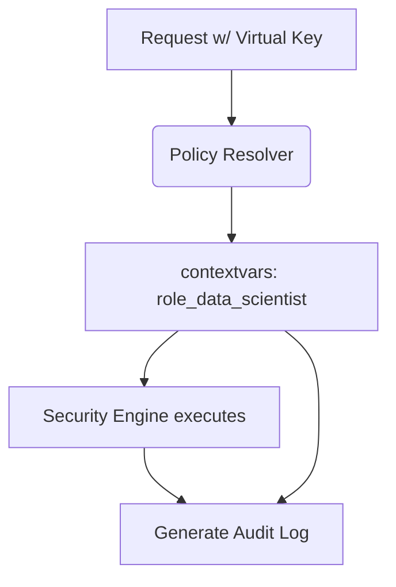

# Applied Role Name in Audit Events

[⬅️ Back to Features Catalog](/docs/features-overview)

## What It Does
The **Applied Role Name in Audit Events** feature records the role name returned by the supported policy-resolution path for an event. It is useful correlation metadata; its accuracy depends on identity mapping, resolver behavior, event delivery, and audit integrity.

## How It Works
When a user authenticates, their `virtual_key_id` maps to a specific role (e.g., `role_data_scientist`).

1. **Context Propagation:** During the authentication phase, the resolved role name is injected into Python's `contextvars`.
2. **Event enrichment:** Supported audit and OSCAL paths read the role name from request context.
3. **Structured output:** The emitted event can include
   `"applied_role_name": "role_data_scientist"`. Retention depends on the configured sink.

View diagram on GitHub mobile 📱 -->

## Performance Profile
- **Performance:** Workload and environment dependent; measure this path under the published benchmark protocol.
- **Overhead:** Adds a role-name field to supported events. Measure serialization, queue, signing, and retention cost in the chosen audit mode.

## Configuration Flags
No separate flag enables this field. It appears only on the instrumented event paths that supply
the resolved role.

## Critical Logic & Edge Cases
* **Fallback role:** Main-route behavior depends on whether a `default_role` exists and on `SHIELD_FAILURE_MODE`; the MCP resolver has separate defaults. Test the actual event field for mapped, fallback, and denied callers.
* **Identity evidence:** Where both authenticated identity and applied role are emitted, retain and verify both fields. Their presence does not prevent impersonation or privilege escalation.

## FAQ

**Q: Why is this important for SOC 2?**
A: Recording `applied_role_name` can help connect an observed decision to the policy name selected at that boundary. Auditors still need evidence for identity mapping, policy contents and approvals, configuration history, completeness, and control operation.

## Practical effect
The supported audit events can include the role name resolved at the decision boundary. This helps an auditor join an event to policy evidence, but does not by itself prove identity mapping, policy contents, approval history, completeness, or control effectiveness.

## Related Tests
Tests: [`tests/test_policy_engine.py`](https://github.com/ninadphalak/LLM-Shield-Proxy/blob/main/tests/test_policy_engine.py).
