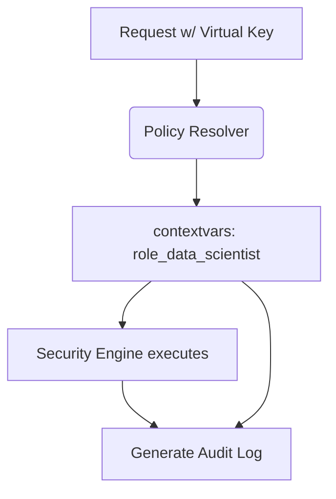

# Applied Role Name in Audit Events

[⬅️ Back to Features Catalog](/docs/features-overview)

## What It Does
The **Applied Role Name in Audit Events** feature records the specific RBAC role (e.g., `role_data_scientist`) that was used to authorize a request. This provides correlation metadata in the audit log to connect a proxy decision back to the specific policy that governed it.

## How It Works
When a user authenticates, their `virtual_key_id` is mapped to a specific role.

1. **Context Propagation:** During authentication, the resolved role name is injected into Python's `contextvars`, making it available throughout the request lifecycle.
2. **Event Enrichment:** Supported audit and OSCAL telemetry paths read this role name from the request context.
3. **Structured Output:** The emitted audit event includes an `"applied_role_name"` field.

## Performance Profile
- **Overhead:** Extracting context and appending a string field to audit events introduces negligible overhead.

## Configuration Flags
No separate flag enables this field. It appears automatically on instrumented event paths whenever a role is successfully resolved.

## Implementation Details & Edge Cases
* **Fallback Roles:** If a `virtual_key_id` is not explicitly mapped, the proxy may fall back to a `default_role`, depending on configuration. Always inspect the audit event to see which role actually applied.
* **Identity Evidence:** This field only records the *applied* role. It does not prove the true identity of the caller or prevent impersonation if the `virtual_key_id` was compromised.

## FAQ

**Q: Why is this important for SOC 2?**
A: Recording the `applied_role_name` connects an observed system action to the specific policy version active at that time. Auditors still require separate evidence that the policy itself was approved, configured correctly, and mapped to the right users.

## Practical Effect
Supported audit events include the role name resolved at the decision boundary. This helps trace an event to a policy, but does not independently establish non-repudiation or identity mapping.

## Related Tests
Tests: [`tests/test_policy_engine.py`](https://github.com/ninadphalak/LLM-Shield-Proxy/blob/main/tests/test_policy_engine.py).
