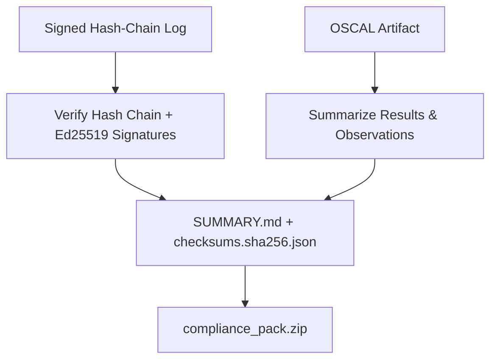

# Compliance-Pack CLI Export

[⬅️ Back to Features Catalog](/docs/features-overview)

## What It Does
**Compliance-Pack CLI Export** creates a ZIP file containing an OSCAL assessment-results
artifact, an audit-log verification summary when a log is supplied, a SHA-256 manifest, and a
Markdown summary. Run it with
`llm-shield-proxy compliance-report --framework=[hipaa|soc2|nist] --out=pack.zip`.

The pack organizes evidence. It does not certify compliance or prove that omitted evidence and
controls are complete.

## How It Works
1. **Audit Evidence Verification:** Given `--audit-log`, the CLI re-walks the signed JSONL
   file, recomputing the SHA-256 hash chain and (given `--pubkey-file`, the PEM from
   [`GET /api/v1/audit/pubkey`](./ed25519-signed-audit-receipts.md)) verifying every
   Ed25519 signature - flagging any hash mismatch, chain discontinuity, or invalid
   signature as a chain break.
2. **OSCAL Summarization:** Given `--oscal-file` (e.g. from the
   [GRC Sidecar File Transport](./grc-webhook-sidecar-file-transport.md)), it counts
   assessment-result sets and observations; otherwise it generates a fresh OSCAL shell via
   the [`DecisionTraceExporter`](./universal-decision-trace-exporter.md).
3. **Integrity Manifest:** Every bundled artifact (OSCAL JSON, audit summary, chain-break
   report, and the source audit log itself) is SHA-256 checksummed into
   `checksums.sha256.json`.
4. **Markdown Narrative:** A framework-specific summary (HIPAA 45 CFR §164.312, SOC 2 CC6/
   CC7, or NIST SP 800-53 Rev. 5) is generated from the verified evidence and written as
   `SUMMARY.md` inside the pack.

## Performance Profile
- **Performance:** Verification reads the supplied audit log, so work grows with event count.
- **Runtime effect:** The command runs outside the proxy request path. It still consumes CPU,
  memory, and file I/O wherever it is executed.

## Configuration Flags
This is a CLI subcommand, not a runtime engine flag:

| Flag | Description |
| :--- | :--- |
| `--framework` | `hipaa`, `soc2`, or `nist` - selects the Markdown narrative and regulatory reference. |
| `--out` | Output `.zip` path (default `./compliance_pack.zip`). |
| `--audit-log` | Path to a signed hash-chain audit JSONL file. Omit to skip audit evidence. |
| `--oscal-file` | Path to a persisted OSCAL JSON/JSONL artifact. Omit to generate an empty OSCAL shell. |
| `--pubkey-file` | PEM file with the proxy's Ed25519 audit public key, to verify receipt signatures. |

## Critical Logic & Edge Cases
* **Missing evidence is allowed:** Omitting `--audit-log` or `--oscal-file` produces a pack with
  `chain_valid: null` or an empty OSCAL shell. Such a pack tests the file format but is not complete
  audit evidence.
* **Non-Zero Exit on Tamper:** The CLI exits `1` when hash-chain verification fails,
  so it can gate a CI job or scheduled compliance run rather than silently produce a pack
  that documents its own tampering.
* **Signature Verification Is Opt-In:** Without `--pubkey-file`, the hash chain is still
  verified, but Ed25519 signatures are reported as unchecked rather than failing the run -
  the public key must be distributed out-of-band from the log file itself.

## FAQ

**Q: Does this require the proxy to be running?**
A: No. It operates entirely on files you already have - a captured signed audit log and an
optional OSCAL artifact - so it can run as a standalone step in a compliance pipeline.

**Q: Can I automate this for recurring audits?**
A: Yes - since it's a plain CLI with a non-zero exit code on integrity failure, it fits
directly into a cron job or CI pipeline that archives the resulting `.zip` on a schedule.

## Practical effect
The command collects the supplied files, checks the evidence it can verify, and writes a ZIP with
a summary and checksums. Review its missing-evidence fields and verification status before giving
it to an auditor.

## Tests

[`tests/test_compliance_report.py`](https://github.com/ninadphalak/LLM-Shield-Proxy/blob/main/tests/test_compliance_report.py) covers report generation and tamper detection.
