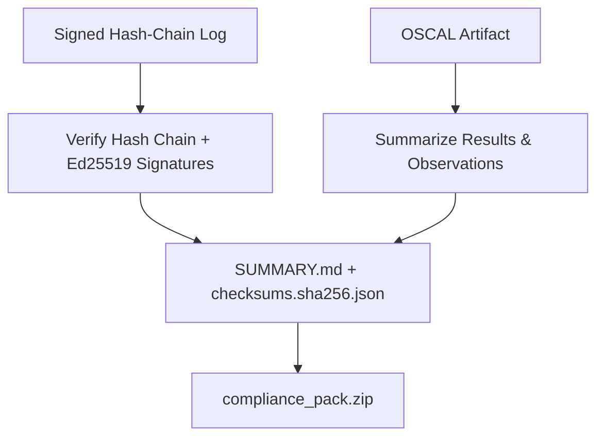

# Compliance-Pack CLI Export

[⬅️ Back to Features Catalog](/docs/features-overview)

## What It Does
The **Compliance-Pack CLI Export** tool generates a `.zip` file containing an OSCAL assessment-results artifact, a verified audit-log summary, a SHA-256 manifest, and a Markdown narrative. This organizes evidence for an auditor, but it does not independently certify compliance or prove that all required controls are implemented.

## How It Works
The command (`llm-shield-proxy compliance-report --framework=[hipaa|soc2|nist] --out=pack.zip`) orchestrates several steps:

1. **Audit Evidence Verification:** If given an `--audit-log`, the CLI re-walks the JSONL file to recompute the SHA-256 hash chain. If a `--pubkey-file` is provided, it verifies every Ed25519 signature. Any mismatch breaks the chain.
2. **OSCAL Summarization:** If given an `--oscal-file`, it parses and summarizes the observations. Otherwise, it generates an empty OSCAL shell.
3. **Integrity Manifest:** The CLI computes a SHA-256 checksum for every generated artifact and saves it as `checksums.sha256.json`.
4. **Markdown Narrative:** The CLI generates a framework-specific `SUMMARY.md` file (e.g., mapping to HIPAA 45 CFR §164.312 or SOC 2 CC6) based on the verified evidence.

## Performance Profile
- **Overhead:** The tool runs outside the proxy's request path (e.g., via a CLI command). Resource usage scales with the size of the provided audit log.

## Configuration Flags

| CLI Flag | Description |
| :--- | :--- |
| `--framework` | `hipaa`, `soc2`, or `nist` - selects the Markdown narrative template. |
| `--out` | Output `.zip` path (default `./compliance_pack.zip`). |
| `--audit-log` | Path to a signed hash-chain JSONL file. Omit to skip audit evidence. |
| `--oscal-file` | Path to a persisted OSCAL JSON/JSONL artifact. Omit to generate a shell. |
| `--pubkey-file` | PEM file with the Ed25519 public key, used to verify signatures. |

## Implementation Details & Edge Cases
* **Missing Evidence is Permitted:** Omitting the log or OSCAL files will produce an empty or `chain_valid: null` report. This tests the pipeline but does not constitute complete evidence.
* **Non-Zero Exit on Tamper:** The CLI returns exit code `1` if the hash chain or signatures fail validation, allowing it to gate CI/CD pipelines or cron jobs.
* **Opt-In Signature Verification:** If `--pubkey-file` is omitted, the CLI only verifies the unkeyed hash chain.

## FAQ

**Q: Does this require the proxy to be running?**
A: No. It operates on static files generated by the proxy, so it can run independently in a CI pipeline or cron job.

**Q: Can I automate this for recurring audits?**
A: Yes. Because it exits with a non-zero code upon failure, it is designed specifically for automated compliance archiving schedules.

## Practical Effect
The CLI bundles supplied logs and OSCAL files, cryptographically verifies them if configured, and outputs a formatted zip package for compliance reviews.

## Tests
Tests: [`tests/test_compliance_report.py`](https://github.com/ninadphalak/LLM-Shield-Proxy/blob/main/tests/test_compliance_report.py).
