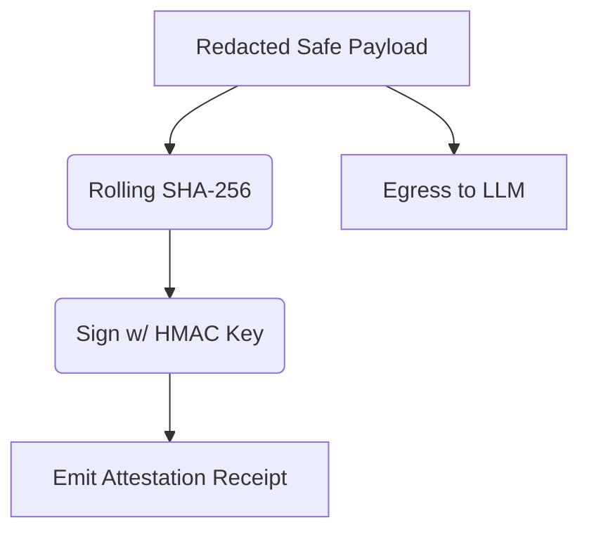

# Cryptographic Proof of Non-Egress Stream Attestation

[⬅️ Back to Features Catalog](../../../features-overview.md)

## What It Does
**Cryptographic Proof of Non-Egress Stream Attestation** solves the problem of proving a negative. When dealing with strict Data Residency laws (like GDPR or EU sovereign clouds), you must legally prove that sensitive PII *never left* your VPC. This feature generates a cryptographically signed receipt for every single session, proving exactly what text was sent to the upstream LLM.

## How It Works
If a regulatory body audits an LLM interaction, you need mathematical proof of what the upstream provider received, without actually storing the prompt in a database.

1. **Rolling SHA-256:** As the proxy evaluates the user's prompt and applies the PII masking (e.g., swapping "John" for "Michael"), it pipes the *final, safe egress text* through a rolling SHA-256 digest function.
2. **HMAC Signature:** Once the request is fully dispatched, the proxy signs this SHA-256 digest using a highly secure, symmetric `ATTESTATION_HMAC_KEY`.
3. **Receipt Emission:** The proxy emits this receipt (containing the `Request-ID`, `Timestamp`, and `HMAC-Signature`) into the audit log, or appends it as an HTTP Response Header (`X-Shield-Attestation`) returning to the client.

View diagram on GitHub mobile 📱 -->

## Performance Profile
- **Execution Speed:** Rolling hashes are extremely fast, calculated simultaneously with the JSON lexer in `&lt;1µs`.
- **Overhead:** Minimal CPU overhead; strictly CPU-bound math operations that do not block network I/O.

## Configuration Flags

| Environment Variable | Description | Linked Deployment Guide |
| :--- | :--- | :--- |
| `ENABLE_EGRESS_ATTESTATION` | Toggles the generation of cryptographic receipts. | [View in deployment.md](../../deployment.md) |
| `ATTESTATION_HMAC_KEY` | The secret symmetric key used to sign the receipts (load from Vault). | [View in deployment.md](../../deployment.md) |

## Critical Logic & Edge Cases
* **Verification Process:** If an auditor demands proof for a specific `Request-ID`, your developers can reconstruct the sanitized payload, run it through the HMAC function using the securely vaulted key, and the resulting signature will perfectly match the signature in the audit logs, proving the data was sanitized.
* **Streaming Responses:** The attestation strictly covers the *ingress* data leaving your VPC. The downstream SSE stream from the LLM is covered by standard distributed tracing, as the proxy has already verified it is safe via the Rehydration Buffer.

## FAQ

**Q: Does this store the user's prompt in the proxy?**
A: No. The text is passed through a one-way cryptographic hash function. It is impossible to reverse the SHA-256 hash back into the original prompt, maintaining perfect data privacy while providing mathematical verification.

**Q: How do I rotate the `ATTESTATION_HMAC_KEY`?**
A: The key can be safely rotated inside HashiCorp Vault. The proxy will seamlessly pick up the new key on restart. Receipts are always logged with a timestamp, allowing auditors to correlate which key version was active at the time of the signature.

## Plainspeak
This feature creates a mathematically guaranteed receipt proving that sensitive data was successfully redacted.

When an AI streams a long response, how do you prove to an auditor that no Social Security Numbers accidentally leaked out? This feature calculates a unique digital fingerprint of the data as it flows out. At the very end of the stream, it attaches this fingerprint like a wax seal. If anyone questions the security later, this seal serves as absolute mathematical proof that the data was sanitized.

## Related Tests
See the following test file for reference implementations and edge-case testing: [`tests/test_attestation.py`](../../../tests/test_attestation.py).
