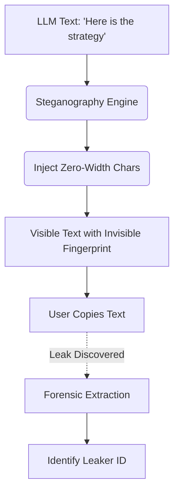

# Dynamic Canary Watermarking & Steganography

[⬅️ Back to Features Catalog](/docs/features-overview)

## What It Does
**Dynamic Canary Watermarking & Steganography** can add a keyed zero-width correlation marker to configured output. If enough of the marker survives copying and normalization, the decoder can associate it with recorded metadata. The marker is removable and does not by itself establish who disclosed content.

## How It Works
Copied text often loses provenance. A zero-width marker can provide one investigation signal, subject to false attribution, removal, normalization, and chain-of-custody limits.

1. **Fingerprint generation:** For a supported response, the proxy derives identity and watermark fingerprints with the operator-supplied `SHIELD_WATERMARK_SECRET`, then binds the marker to the session ID and current epoch minute. The same credential produces a different identity fingerprint under a different deployment secret.
2. **Binary Encoding:** This fingerprint is converted into a binary sequence (1s and 0s).
3. **Zero-width injection:** On the supported SSE path, the proxy appends or inserts encoded zero-width Unicode characters. Rendering, normalization, copying, sanitization, and model/client behavior can alter or remove them.
4. **Extraction:** The included decoder recovers the embedded hexadecimal fingerprint. It does not reverse the HMAC to an identity; correlation requires separately retained candidate metadata and time context.

View diagram on GitHub mobile 📱 -->

## Performance Profile
- **Performance:** Workload and environment dependent; measure this path under the published benchmark protocol.
- **Overhead:** The marker uses 66 zero-width Unicode code points for the current 16-hex-character fingerprint plus delimiters. UTF-8 byte cost, tokenization, rendering, and downstream effects must be measured.

## Configuration Flags

| Environment Variable | Description | Linked Deployment Guide |
| :--- | :--- | :--- |
| `ENABLE_WATERMARKING` | Toggles the injection of zero-width cryptographic watermarks. | [View in deployment.md](/docs/deployment) |
| `SHIELD_WATERMARK_SECRET` | Operator-supplied HMAC secret; required when watermarking or the canary tripwire is enabled. | [View in deployment.md](/docs/deployment) |

## Critical Logic & Edge Cases
* **Resilience testing:** Redundant encoding can improve recovery from some truncation, but survival depends on which text remains and on normalization, copying, sanitization, and re-encoding. Publish recovery rates for declared transformations rather than assuming a marker survives.
* **Removal:** Unicode normalization, sanitization, retyping, format conversion, or deliberate stripping can remove or alter the marker. Publish measured survival rates for the specific channels used in an investigation.

## FAQ

**Q: Will the invisible characters confuse downstream systems or APIs?**
A: These are valid Unicode code points, but applications can render, normalize, strip, search, count, copy, or serialize them differently. Test each browser, editor, messaging system, PDF path, accessibility tool, and byte/character limit you intend to use.

**Q: Does this alter the actual AI output or meaning?**
A: The encoder is designed not to change visible code points, but zero-width characters can affect search, normalization, token counts, copy/paste, accessibility tools, signatures, or downstream parsers. Test the complete client workflow.

## Plainspeak
This feature acts as an invisible tracking tag to help catch leaks.

This feature adds a keyed, zero-width correlation marker to supported output. If enough of the marker survives, a decoder can associate it with recorded metadata. It is removable and forgeable by parties with relevant access, and it does not independently establish who disclosed text or when.

## Related Tests
See the following test file for reference implementations and edge-case testing: [`tests/test_watermark.py`](https://github.com/ninadphalak/LLM-Shield-Proxy/blob/main/tests/test_watermark.py).
