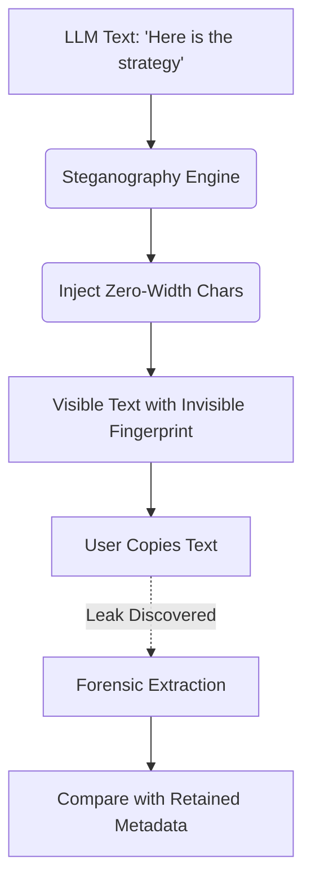

# Zero-Width Correlation Marker

[⬅️ Back to Features Catalog](/docs/features-overview)

## What It Does
The **Zero-Width Correlation Marker** uses steganography to embed a keyed, invisible correlation identifier directly into the text generated by the model. If the text is copied and leaked, extracting the surviving marker provides an investigation signal linking the text to a specific session.

## How It Works
Copied text loses origin metadata (like HTTP headers or request IDs). A zero-width marker attempts to embed a signal into the text itself.

1. **Fingerprint Generation:** The proxy uses the `SHIELD_WATERMARK_SECRET` to derive a cryptographic fingerprint binding the session ID to the current epoch minute.
2. **Binary Encoding:** This fingerprint is converted into a binary sequence.
3. **Zero-Width Injection:** The proxy encodes the binary sequence using invisible, zero-width Unicode characters and appends or inserts them into the SSE stream. 
4. **Extraction:** A bundled decoder utility can recover the embedded hexadecimal fingerprint from copied text. It does not reverse the HMAC back to an identity; you must cross-reference the fingerprint against retained audit logs to find the original session.

## Performance Profile
- **Overhead:** The marker injects roughly 66 zero-width Unicode code points per fingerprint. Measure downstream tokenization effects, byte costs, and rendering latency in your specific client application.

## Configuration Flags

| Environment Variable | Description | Linked Guide |
| :--- | :--- | :--- |
| `ENABLE_WATERMARKING` | Toggles the injection of zero-width cryptographic watermarks. | [View in deployment.md](/docs/deployment) |
| `SHIELD_WATERMARK_SECRET` | Operator-supplied HMAC secret required for generating the watermark. | [View in deployment.md](/docs/deployment) |

## Implementation Details & Edge Cases
* **Removal and Evasion:** The marker relies on standard Unicode characters. Normalization processes, format conversions (e.g., saving to PDF), sanitization scripts, or a user deliberately re-typing the text can destroy the marker.
* **Resilience:** The proxy relies on redundant encoding to survive partial truncation, but you must measure survival rates through your organization's specific communication channels before relying on it.

## FAQ

**Q: Will the invisible characters confuse downstream systems or APIs?**
A: They are valid Unicode code points. However, downstream systems may count them against character limits, strip them, or expose them in specific accessibility tools. Test the workflow end-to-end.

**Q: Does this alter the actual AI output or meaning?**
A: Visually, no. However, it changes the byte composition of the string, which can affect exact-match searches, regex boundaries, and byte-length calculations.

## Practical Effect
This feature embeds a hidden, cryptographic watermark in model output. It provides a forensic correlation signal during data leak investigations, but it is not tamper-proof and does not independently prove attribution.

## Related Tests
Tests: [`tests/test_watermark.py`](https://github.com/ninadphalak/LLM-Shield-Proxy/blob/main/tests/test_watermark.py).
