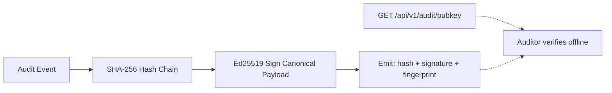

# Ed25519-Signed Audit Receipts

[⬅️ Back to Features Catalog](/docs/features-overview)

## What It Does
The **WORM-Compliant Audit Logging with Hash Chaining** engine makes every audit event
tamper-*evident* relative to the rest of the log — but an auditor still has to trust
whoever operates the log store. **Ed25519-Signed Audit Receipts** closes that gap: every
audit event is cryptographically signed with an Ed25519 private key held only by the
proxy instance, giving each record non-repudiation — proof it was provably emitted by
*this* proxy, not fabricated or replayed by whoever has write access to the log sink.

## How It Works
1. **Key Provisioning:** On startup, the proxy loads an Ed25519 private key from
   `AUDIT_SIGNING_PRIVATE_KEY` (a PEM string or a 32-byte seed, base64 or hex). If unset,
   it generates an ephemeral key so signing is always active, even in dev/test.
2. **Hash-Chain First:** The existing SHA-256 hash-chaining logic runs unchanged —
   `previous_hash` links the event to its predecessor, and `hash` covers the event payload.
3. **Signature Append:** The background WORM worker thread signs the canonical
   hash-chained JSON string with Ed25519 and appends `signature` (base64) and
   `public_key_fingerprint` (SHA-256 of the raw public key) to the emitted record — entirely
   off the ASGI event loop, so request latency is unaffected.
4. **Public Key Distribution:** `GET /api/v1/audit/pubkey` publishes the proxy's Ed25519
   public key (PEM) and fingerprint, so an auditor or SIEM can verify receipts offline,
   without needing any access to the proxy itself.

## Performance Profile
- **Execution Speed:** Ed25519 signing is sub-microsecond per event and runs entirely on
  the existing dedicated background WORM worker thread.
- **Overhead:** Zero added latency on the request path — signing failures are caught and
  swallowed so they can never break hash-chain continuity or block a request.

## Configuration Flags

| Environment Variable | Description |
| :--- | :--- |
| `AUDIT_SIGNING_PRIVATE_KEY` | Ed25519 private key (PEM or 32-byte seed, base64/hex) used to sign audit receipts. Ephemeral key generated automatically if unset. |

## Critical Logic & Edge Cases
* **Canonical Reconstruction:** The signature covers the exact on-disk JSON text (fields
  appended in write order, not re-sorted), so verification must strip `signature` /
  `public_key_fingerprint` and re-serialize preserving that order — `llm-shield-proxy
  compliance-report` implements this correctly and is the reference verifier.
* **Ephemeral Keys:** Without `AUDIT_SIGNING_PRIVATE_KEY` set, a fresh key is generated on
  every restart. Signatures remain internally self-consistent, but a stable key is required
  for cross-restart auditor verification in production.
* **Fail-Open Signing:** A signing failure (e.g., corrupted key state) never drops or
  delays the underlying hash-chained event — it is logged unsigned rather than lost.

## FAQ

**Q: How is this different from the existing WORM hash chain?**
A: The hash chain proves the log hasn't been tampered with *relative to itself* — an
attacker with write access to the log store could still rewrite the entire chain from
scratch. The Ed25519 signature proves each record was signed by a private key that only
the proxy instance holds, so a rewritten chain would fail signature verification against
the publicly distributed key.

**Q: Do I need to configure anything to get signed receipts?**
A: No — signing is on by default using an ephemeral key. Set `AUDIT_SIGNING_PRIVATE_KEY`
only when you need signatures to remain verifiable against the same public key across
proxy restarts.

## Plainspeak
This feature puts a tamper-proof wax seal on every log entry. The hash chain already
proves nobody edited a page after it was written; the Ed25519 signature proves *which
specific proxy* wrote that page in the first place — so an auditor doesn't have to take
your word for it.

## Related Tests
See [`tests/test_audit_signing.py`](https://github.com/ninadphalak/LLM-Shield-Proxy/blob/main/tests/test_audit_signing.py) for reference implementations and tamper-detection edge cases.
