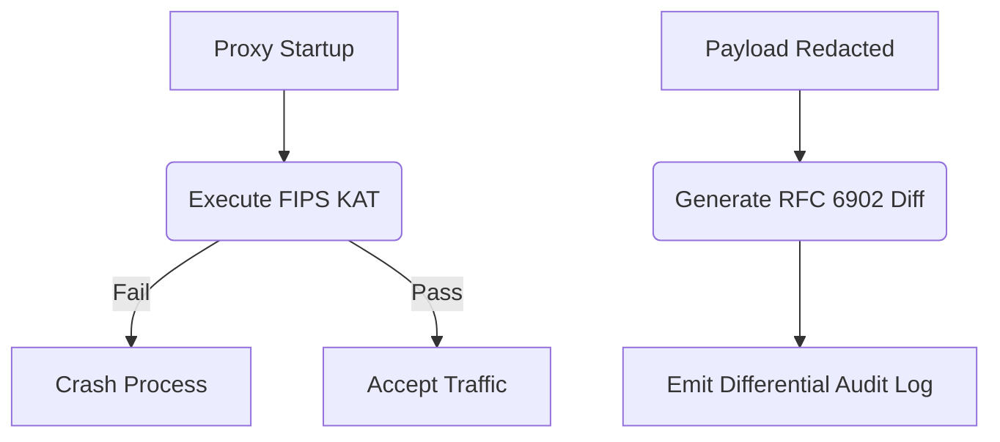

# FIPS 140-3 KAT & RFC 6902 Differential Audit Logging

[⬅️ Back to Features Catalog](/docs/features-overview)

## What It Does
This feature provides cryptographic implementation self-tests and structured mutation metadata that can support federal control evidence. A Known Answer Test is not FIPS 140-3 validation, FedRAMP authorization, or DoD IL5 approval; those depend on the validated module, platform, configuration, and assessment boundary.

## How It Works
Federal auditors require absolute proof that crypto engines are functioning correctly and that data modifications are precisely tracked.

1. **FIPS 140-3 KAT:** On startup, and periodically during operation, the proxy executes Known Answer Tests against the underlying OpenSSL libraries. It encrypts a known string with a known AES-256-GCM key and verifies the ciphertext matches a hardcoded, mathematically proven answer. If it fails, the proxy immediately enters a terminal `CrashLoopBackOff`, refusing to process data with broken cryptography.
2. **RFC 6902 Differential Logging:** Instead of just logging "We redacted PII", the proxy calculates the exact diff between the original prompt and the redacted prompt. It emits an RFC 6902 compliant JSON Patch array (e.g., `[{"op": "replace", "path": "/messages/0/content", "value": "***"}]`).

View diagram on GitHub mobile 📱 -->

## Performance Profile
- **Performance:** Workload and environment dependent; measure this path under the published benchmark protocol.
- **Overhead:** Extremely low.

## Configuration Flags

| Environment Variable | Description | Linked Deployment Guide |
| :--- | :--- | :--- |
| `ENABLE_FIPS_STRICT_MODE` | Enforces KAT validation and disables non-FIPS approved ciphers. | [View in deployment.md](/docs/deployment) |
| `ENABLE_RFC6902_LOGGING` | Toggles the generation of differential JSON patches in the audit logs. | [View in deployment.md](/docs/deployment) |

## Critical Logic & Edge Cases
* **Host OS dependency:** A FIPS claim requires an appropriately validated cryptographic module operated within its security policy. The proxy's self-test does not confer that status on Python, OpenSSL, the host, or the deployment.
* **Data Privacy in Diffs:** Even in differential logging, the *original* sensitive value is never logged. The JSON patch explicitly shows the `value` being injected (the synthetic name or `***`), but never the `old_value` that was removed, preserving the integrity of the logging pipeline.

## FAQ

**Q: Does enabling `ENABLE_FIPS_STRICT_MODE` slow down the proxy?**
A: No. It simply enforces cryptographic boundary checks and ensures that weak ciphers (like DES or MD5) are physically unavailable to the proxy's TLS and masking engines. Execution speed remains identical.

**Q: Why is RFC 6902 better than standard logging?**
A: Because it is a deterministic, machine-readable standard. An auditor can write a script that takes the final payload, applies the RFC 6902 patch in reverse, and mathematically prove the sequence of operations the proxy executed on the payload.

## Plainspeak
This feature proves to government auditors that our encryption math isn't broken.

High-security environments (like the government) don't just trust that your encryption works; they demand proof. Every time the proxy starts up, it forces itself to take a math test (encrypting a known word and checking the result). If it fails the test, it instantly shuts down, refusing to handle any real data with broken encryption.

## Related Tests
See the following test file for reference implementations and edge-case testing: [`tests/test_fips_and_audit_diff.py`](https://github.com/YOUR_ORG/LLM-Shield-Proxy/blob/main/tests/test_fips_and_audit_diff.py).
